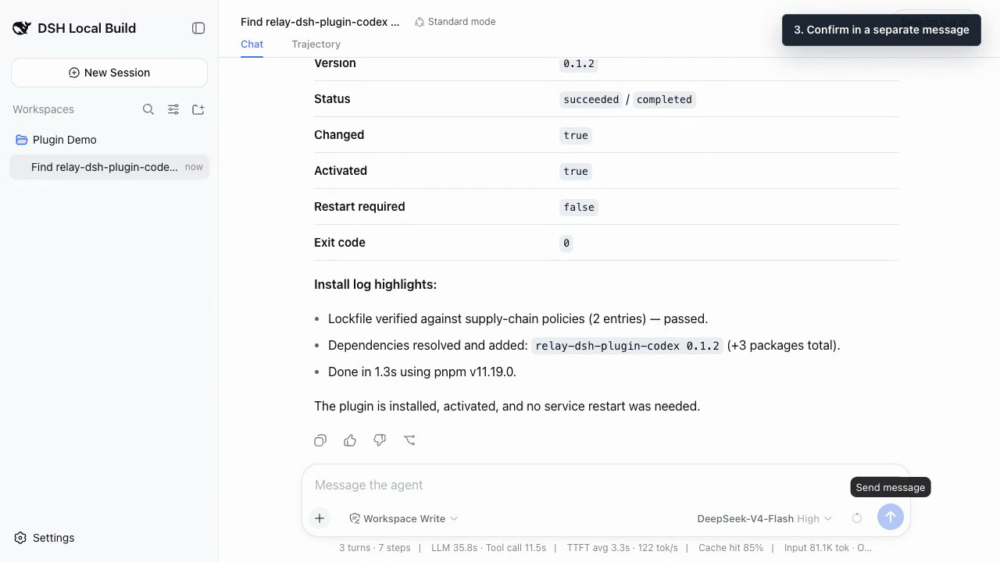

# Relay

Plugin guide: [English](docs/dsh-plugins.md) | [中文](docs/dsh-plugins.zh.md)

**Add Codex, Claude Code, plugin management, workspace files, and a terminal to
the official DeepSeek Harness, without maintaining a DSH fork.**

Relay is an open-source integration and runtime workspace for long-running Agent
work. Its independently published DSH plugins are usable today: install only the
capabilities you need, keep the official DSH core unchanged, and manage them from
the DSH CLI or an ordinary Chat conversation. No Relay checkout is required.

[](docs/media/dsh-plugin-manager-codex-install-demo.en.mp4?raw=1)

*A real 40-second run on official DSH: search, review the proposed change,
confirm it separately, and finish with the Codex plugin installed. [Watch the
demo](docs/media/dsh-plugin-manager-codex-install-demo.en.mp4?raw=1).*

## Try It Now

Already running official DSH? Stop DSH Web, install the conversation-first
Plugin Manager, and restart:

```bash
dsh plugin --profile web add relay-dsh-plugin-manager@latest
dsh web
```

Then ask in Chat:

```text
/plugins find a Codex conversation backend
```

Search and inspection are read-only. Installation, update, enablement,
disablement, removal, or restart shows a plan and requires a separate
confirmation. KeySync's one-click DSH setup already includes Plugin Manager.

**Choose your path:** [install a specific plugin](docs/dsh-plugins.md#choose-what-you-need)
· [read the Chinese guide](docs/dsh-plugins.zh.md) ·
[report install feedback](https://github.com/yangbobo2021/Relay/issues)

## Why Star Relay?

- Keep official DSH unpatched while adding the Agent backends and workspace views
  your project needs.
- Use Codex or Claude Code as native DSH conversation modes, then combine the
  optional Files and Terminal views in the same workspace.
- Follow the next layer of long-running Agent work: durable Waits and Monitors,
  external Events, and delivery back into the correct existing conversation.

If that direction is useful to you, [star Relay](https://github.com/yangbobo2021/Relay)
so more DSH users can discover the no-fork plugin path.

Relay's runtime direction goes beyond the plugin suite. An ordinary DSH
conversation can register Waits and durable local Monitors; Relay routes incoming
Events back into the correct conversation. A DSH Session may use DSH's default
Agent or bind a Codex Thread as its execution and model-context backend.

## DSH Plugin Catalog

Published plugins can be installed on official DSH without checking out this
repository. Relay pins their repositories as submodules for distribution,
compatibility testing, and cross-plugin validation. Events, Semantic Router and
Monitors now also have independent repositories; their initial delivery uses
built tarballs, not an assumed npm publication.

See the [complete plugin chooser and installation guide](docs/dsh-plugins.md)
([中文](docs/dsh-plugins.zh.md)) for npm and GitHub setup recipes, dependencies,
verification, and real DSH UI evidence.

| Plugin | Repository | npm package | Purpose |
| --- | --- | --- | --- |
| Plugin Manager | [`relay-dsh-plugin-manager`](https://github.com/yangbobo2021/relay-dsh-plugin-manager) | [`relay-dsh-plugin-manager`](https://www.npmjs.com/package/relay-dsh-plugin-manager) | Discovers and manages DSH plugins through Chat; included by KeySync's one-click DSH install. |
| Codex | [`relay-dsh-plugin-codex`](https://github.com/yangbobo2021/relay-dsh-plugin-codex) | [`relay-dsh-plugin-codex`](https://www.npmjs.com/package/relay-dsh-plugin-codex) | Adds Codex as a DSH conversation backend. |
| Claude Code | [`relay-dsh-plugin-claude`](https://github.com/yangbobo2021/relay-dsh-plugin-claude) | [`relay-dsh-plugin-claude`](https://www.npmjs.com/package/relay-dsh-plugin-claude) | Adds Claude Code as a DSH conversation backend. |
| Workbench | [`relay-dsh-plugin-workbench`](https://github.com/yangbobo2021/relay-dsh-plugin-workbench) | [`relay-dsh-plugin-workbench`](https://www.npmjs.com/package/relay-dsh-plugin-workbench) | Provides the shared right/bottom panel shell for DSH view plugins. |
| Files | [`relay-dsh-plugin-files`](https://github.com/yangbobo2021/relay-dsh-plugin-files) | [`relay-dsh-plugin-files`](https://www.npmjs.com/package/relay-dsh-plugin-files) | Adds a right-side workspace file browser. |
| Terminal | [`relay-dsh-plugin-terminal`](https://github.com/yangbobo2021/relay-dsh-plugin-terminal) | [`relay-dsh-plugin-terminal`](https://www.npmjs.com/package/relay-dsh-plugin-terminal) | Adds a bottom terminal panel and provider registry. |
| Events | [`relay-dsh-plugin-events`](https://github.com/yangbobo2021/relay-dsh-plugin-events) | `relay-dsh-plugin-events` (tarball) | Durable Wait/Event/Delivery, ingress, and management UI. |
| Semantic Router | [`relay-dsh-plugin-semantic-router`](https://github.com/yangbobo2021/relay-dsh-plugin-semantic-router) | `relay-dsh-plugin-semantic-router` (tarball) | Tool-free semantic routing through an existing DSH model route. |
| Monitors | [`relay-dsh-plugin-monitors`](https://github.com/yangbobo2021/relay-dsh-plugin-monitors) | `relay-dsh-plugin-monitors` (tarball) | Durable timers, trusted observers, deterministic checks, and bound triggers. |

The individual plugin READMEs link back here and describe their boundary with
Relay. Relay's repository workflow for these submodules is documented in
[Repository Workflow](docs/spec/repository-workflow.md).

## Build Relay

Start with the [documentation index](docs/README.md). Product requirements and
runtime behavior are defined by the [Relay specification](docs/spec/README.md).

Clone DSH into the ignored upstream directory with `scripts/sync-dsh.sh`. Keep
Relay-owned experiments and compatibility notes in `dsh-lab/` so the immutable
upstream reference can be updated freely.

```text
apps/                         User-facing Relay applications
packages/                     Reserved; no root-owned product runtime
integrations/                 External systems and agent/tool bridges
docs/                         Specification, architecture, and decisions
experiments/                  Short-lived prototypes
fixtures/                     Sanitized test fixtures
scripts/                      Developer automation
tests/                        Cross-package and integration tests
upstream/deepseek-harness/    Local ignored clone of DeepSeek Harness
dsh-lab/                      Relay-owned DSH notes, tests, patches, adapters
```

## Local Vertical Demo

Run the three plugins and synthetic composition checks without a paid model call:

```bash
npm run test:event-plugins
npm run test:package:plugins
node scripts/verify-dsh-official-install.mjs --events-only
```

The official-install test uses disposable profiles and a replay LLM adapter to
verify routing and timer delivery into an existing real DSH Session. It does not
change the running KeySync profile. See the [delivery report](docs/spec/event-plugin-delivery-20260830.md).

## Relay Web

After cloning DSH, start its Web conversation UI with the local Relay bundle:

```bash
npm run start:web -- --host 127.0.0.1 --port 4317
```

Open `http://127.0.0.1:4317`, choose a workspace, and start an ordinary conversation.
Choose the directly visible **Codex** mode on the native New Session screen to run
the conversation through Codex App Server without leaving DSH Web. The Codex
Session keeps DSH's native composer, model/reasoning selector, permission control,
Chat/Trajectory views and message rendering. Choose another mode before the first
message for the ordinary DSH path.

An ordinary DSH Agent can call `relay_schedule_timer` with `after_seconds` and a
continuation prompt; Relay persists the timer and resumes the same DSH Session when
it expires. A Codex-backed Session can register an external-event Wait in its native
conversation view; that Event path does not create a timer or Codex Automation.

Local integrations deliver a real external Event through the running DSH Web host:

```bash
curl -X POST http://127.0.0.1:4317/api/relay/events \
  -H 'content-type: application/json' \
  -d '{"type":"build.completed","source_event_id":"build-42","status":"passed"}'
```

Non-loopback callers must send `Authorization: Bearer <token>` and the host must set
`RELAY_INGRESS_TOKEN`. The response includes the durable Relay Event and Delivery
states; an unmatched Event is accepted without starting a Session turn.

Open **Settings > Waiting events** to inspect live waits and Monitors, open the
owning conversation, cancel its waits, or ask an active Monitor to check now.

The [Codex in DSH Web specification](docs/spec/codex-app-server.md) defines this
integration and its ownership boundary.
