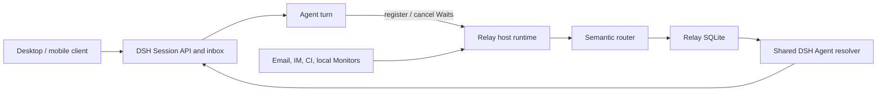

# Architecture

Relay is a DSH plugin subsystem with Host and Agent-plane components.

## Boundaries

- DSH owns conversation creation, history, context, execution, cold resume, and the
  one ordered inbox used by both people and plugins.
- Relay owns Waits, Monitors, external Events, semantic decisions, Delivery retries,
  and their inspectable history.
- Connectors normalize provider input and acknowledge only after Relay persistence.
- Monitor workers observe external state without requiring a live Agent.
- The Agent bridge exposes Relay registration tools inside ordinary DSH turns.
- The inbox adapter uses DSH's shared resolver; it never creates or disposes an Agent
  independently.

The same DSH Session ID links the systems. Relay's record is only a waiting
projection, not a second lifecycle authority.

## Ordering

User input always goes directly to DSH. Relay injects an external Event through the
same DSH inbox. DSH therefore decides the order when a user message and Event arrive
close together. Relay uses a lease only for its own stable Delivery Activation, never
for Agent execution.
