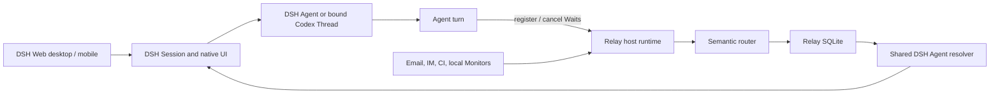

# Architecture

Relay is a DSH plugin subsystem with Host and Agent-plane components.

## Boundaries

- DSH owns the user-facing Session, workspace navigation, input path, title, and
  presentation log for every conversation.
- The selected execution backend owns model context and execution. A Codex-backed DSH
  Session binds one persisted Codex Thread.
- Relay owns Waits, Monitors, external Events, semantic decisions, Delivery retries,
  and their inspectable history.
- Connectors normalize provider input and acknowledge only after Relay persistence.
- Monitor workers observe external state without requiring a live Agent.
- The Agent bridge exposes Relay registration tools inside ordinary DSH turns.
- An inbox adapter resolves the existing DSH Session and its optional backend
  binding; it never creates a user-facing Session in response to an Event.

The DSH Session ID is the UI identity. A persisted binding connects it to a backend
ID, and Relay keys its waiting projection with the runtime-qualified backend ID.

## Ordering

User input enters through DSH's native input path and is admitted by the selected
execution backend. Relay injects an external Event through that same backend path.
The backend decides ordering when input and an Event arrive close together. Relay
leases only its stable Delivery Activation, never Agent execution.
