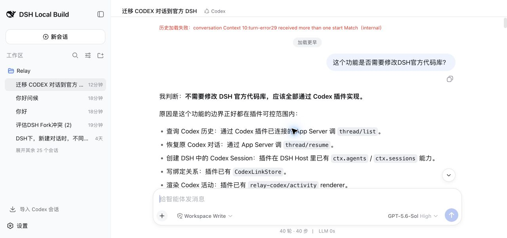
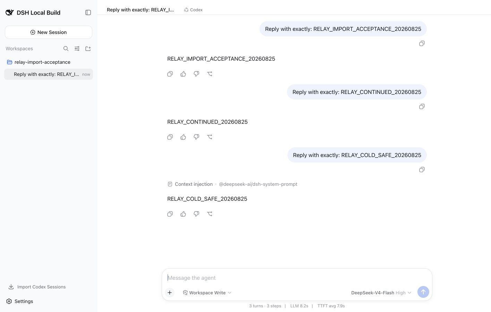

# 为什么刚开始觉得 AI 编程很厉害，用久了就不行了？

> 知乎问题：<https://www.zhihu.com/question/1954568431539036226>
>
> 发布说明：从下方正文开始粘贴；图片使用文中标注的真实本地素材。

我不觉得是 AI 越用越笨了。至少在我最近几个开源插件的开发里，真正恶化的是另一件事：要求越来越多，代码却没有一套持续更新的 SPEC 和功能场景测试来约束。

项目刚开始时，要求通常很小。让 AI 加一个按钮、接一个接口，我手动点几下，功能正常，就觉得它做得又快又好。

几个月后，事情开始变味。修好 A，B 坏了；把 B 修回来，之前已经处理过的 C 又复发。最后一个问题来回改很多轮也收不了尾，看起来就像 AI 突然不会写代码了。

我现在认为，这类问题主要有两个来源。

## 第一，要求留在了对话里，没有留在项目里

一次功能为什么这样设计、哪些旧行为不能改变、插件之间能不能直接调用、发布包必须支持哪些系统，这些要求经常只存在于某一轮聊天中。

对话结束后，下一次 AI 看到的主要是当前代码。它不知道三个月前为什么否决了另一种实现，也不知道某段看起来多余的逻辑是在保护一个真实用户场景。它只能根据局部代码推测意图。

这种推测单独看经常很合理，但可能已经偏离产品要求。修改次数越多，偶然形成的行为越容易被后续 AI 当成正式设计。

所以 SPEC 不能只是开发前写一次的计划。它应该和代码一起进入版本库，功能边界变化时同步修改，并明确告诉下一次开发：什么可以变，什么不能变，什么才算完成。

## 第二，测试覆盖了代码，没有覆盖完整功能场景

以前我也会看测试数量和代码覆盖率。后来发现，对 AI 持续开发更重要的是“场景覆盖率”。

例如，我做的 Codex 对话插件早期依赖系统里的 `codex` 命令。在开发机上能运行，因为机器已经全局安装了 Codex。插件能构建，已有测试也能通过。但换到普通用户的机器，在 DSH 里创建对话只得到一行：`spawn codex ENOENT`。

问题不是启动子进程的代码完全没写，而是测试环境替我们满足了一个没有写进 SPEC 的前提：用户机器上必须已经有 `codex`。

后来我们把验收要求改成：插件自己提供固定版本的官方 Codex App Server 运行时；在没有全局 `codex` PATH 的环境验证；macOS、Windows、Linux 分别跑 CI；最后还要在全新目录安装 npm 正式包，启动未经修改的官方 DSH，创建一次真实对话。

同样的问题也出现在“导入已有 Codex 对话”上。能把一条 Thread 写进 DSH，只是最小路径。真正使用时还包括：

- Workspace 是否只导入自己的对话；
- 标题和最近活动顺序是否保留；
- 重复导入会不会产生副本；
- 中断或失败但已有可见回复的 Turn 是否显示；
- DSH 重启后绑定和历史是否仍在；
- 同一个 Codex Thread 正被别的客户端使用时怎么办。

这些不是多写几个函数单测就自然覆盖的。我们最后把导入拆成 14 个风险场景，再增加真实 App Server、官方 DSH 和浏览器验收。浏览器验证仍然发现过已有测试没有拦住的历史加载错误。

这张图不是为了说明测试没用，恰恰相反：它说明最终用户路径也必须成为测试体系的一部分。

## 错误为什么会越藏越深

整个过程通常是这样的：

1. 新要求只写在聊天里；
2. AI 根据局部代码猜测产品意图；
3. 自动测试没有覆盖被影响的真实场景；
4. 人工测试靠记忆，漏掉了不常用功能；
5. 非预期行为进入下一次开发基线；
6. 后续 AI 又把它当成已有设计继续扩展。

积累到一定程度后，提示词写得再详细也只能修补局部。因为真正缺失的不是某一轮上下文，而是整个仓库没有一套可靠、可持续的约束系统。

## 我们现在怎样做

这几个插件后来的开发流程逐渐固定下来：

1. 开发前先列出可以实际交付验收的用户场景；
2. 先修改 SPEC，再修改代码；
3. 每条重要 SPEC 都要对应自动测试，或者一条明确的人工验收步骤；
4. 人工验收记录环境、步骤和截图，不再只写“手动测试通过”；
5. 每发现一个缺陷，都增加防止它再次发生的回归测试；
6. 每完成一部分，重新检查 SPEC、代码和测试是否仍然一致；
7. 发布前从 npm 正式包和全新环境重新走一次用户路径。

有些界面、跨进程和真实账号场景暂时不适合完全自动化，这不等于它们可以靠人临时想起来。先把它们写成稳定的验收清单，保存证据；一旦某个场景发生回归，再尽量把它转成自动测试。

我现在把 AI 看成一个执行速度很快、但不会替项目长期保存产品意图的开发者。SPEC 负责保存意图，场景测试负责阻止旧功能被悄悄改坏。缺少其中任何一个，代码越多，AI 修改的风险就越高。

我们正在几个公开仓库里继续验证这套方法，包括 SPEC、插件边界测试、跨平台 CI、正式包安装和官方 DSH 浏览器 E2E。它们当然还不完美，更像一组公开实验。感兴趣的人可以直接检查约束和测试是否真的对应，也欢迎指出仍然没有覆盖的场景：

<https://github.com/yangbobo2021/Relay>
