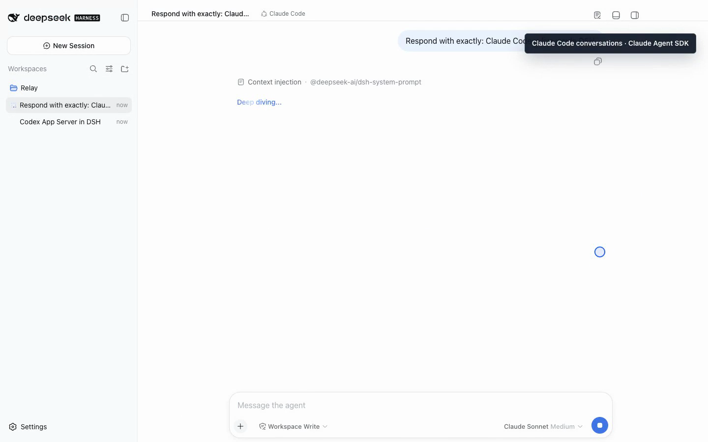

# 分析和审查交给 Claude Code：在 DSH 中保留会话连续性

[English](claude-code-in-dsh.md) | 中文 | [系列目录](dsh-agent-workbench-series.zh.md)

同一个实现交给不同 Agent 看，常常比让一个 Agent 在原思路上反复自检更有价值。
我使用 Claude Code 的典型场景不是替代所有 DSH 对话，而是需要第二种分析路径时：
审查一组改动、比较两个设计，或者把一个已经纠缠很久的问题重新拆开。

真正麻烦的是工具切换。项目在 DSH，代码实现可能在 Codex，审查又跑到 Claude
Code 的另一个窗口。于是我把 Claude Agent SDK 接成了 DSH 的另一种会话后端。



## 不是每轮重新问一次 Claude

插件为一个 DSH Session 绑定一个 Claude Agent SDK Session。第一轮创建 Session，
后续轮次通过同一个 Session ID 继续。工作目录、模型、推理强度和权限选择也跟着这段
会话走。

这和“把聊天历史重新拼成 Prompt 再请求一次”不同。Claude Code 仍然使用自己的
Session 机制；DSH 保存用户看到的会话历史，并把流式回答、工具活动、审批和提问呈现
在统一界面里。

当前默认后端是 Claude Agent SDK。插件还保留 CLI fallback 作为开发兼容路径，但
不会在 fallback 无法暴露 DSH 工具时假装一切正常。需要 DSH contributed tools 的
会话必须使用 SDK 后端。

## 为什么模型选择必须跟着后端变化

集成早期出现过一个容易忽略的问题：切到 Claude Code 模式后，模型菜单仍然可能保留
上一种会话的选项。对用户来说，这比一个明显报错更糟，因为界面看起来能用，实际选择
却不属于当前后端。

现在模式变化会重新读取 Claude 后端提供的模型，并同步默认模型与推理强度。用户选择
Claude Code 后，看到的是 Claude Sonnet、Opus、Haiku 等该后端声明的选项，而不是
Codex 或 DSH 原生模型的残留状态。

这是统一界面的底线：统一的是操作位置，不是抹平不同 Agent 的能力。

## 一次比较自然的审查流程

我会把实现和审查分成两段会话，而不是要求两个 Agent 共享一个不可追踪的上下文：

1. 在 DSH 或 Codex 会话中完成实现，并得到测试结果；
2. 在同一个项目 Workspace 下新建 Claude Code 会话；
3. 给出目标、改动范围和希望重点检查的风险；
4. 让 Claude 读取当前工作树，提出问题或审查意见；
5. 修复后回到同一个 Claude Session 继续复查。

这样做仍然需要人工交接，但每段责任很清楚。Codex 会话记录“怎么实现”，Claude
会话记录“为什么接受或拒绝这组实现”。等以后做自动协调时，也有明确的输入和输出
可以连接。

## 独立安装

Claude 插件不依赖 Codex、Workbench 或 Relay Events。下面的版本针对官方 DSH
`0.1.1-rc.2` 验证过，`next` 当前是包含模型选择同步修复的 `0.1.1-rc.2`：

```bash
npx @deepseek-ai/dsh@0.1.1-rc.2 plugin --profile web add \
  relay-dsh-plugin-claude@next

npx @deepseek-ai/dsh@0.1.1-rc.2 web
```

启动前先按 Claude Code 官方方式完成本地认证。重启 DSH 后，添加项目 Workspace，
新建 Session，在模式菜单选择 **Claude Code**。安装成功后不需要额外激活命令。

- [GitHub 仓库](https://github.com/yangbobo2021/relay-dsh-plugin-claude)
- [npm 包](https://www.npmjs.com/package/relay-dsh-plugin-claude)
- [问题反馈](https://github.com/yangbobo2021/relay-dsh-plugin-claude/issues)

把 Claude Code 放进 DSH，不是为了制造一个新的 Claude 界面。价值在于它和原生
DSH、Codex 一样，都能成为这个项目中一段有归属、可继续、可回看的工作记录。

