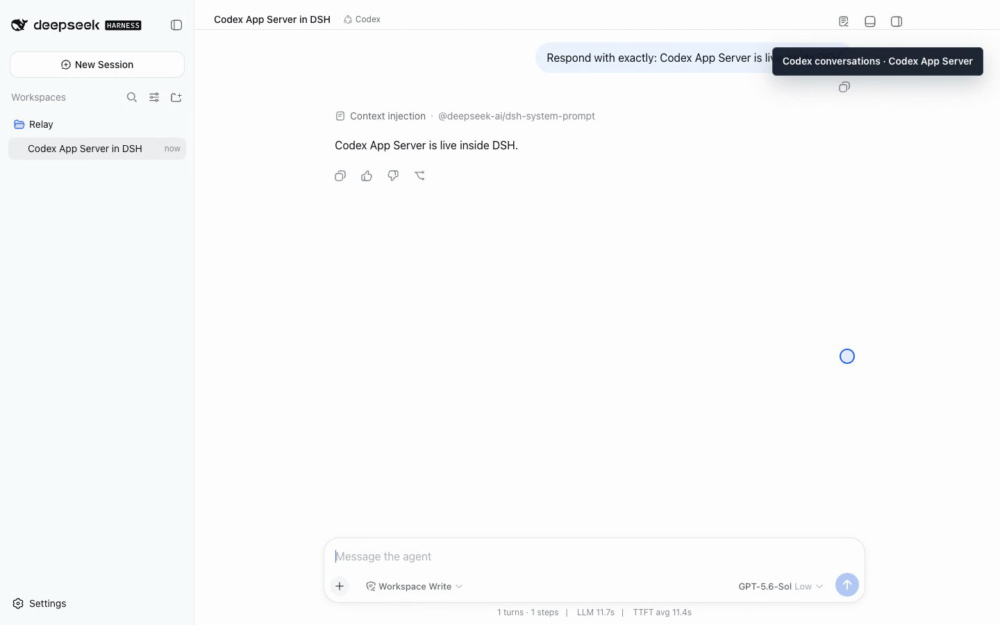

# Give Complex Implementation Work to Codex: Codex App Server Inside DSH

English | [中文](codex-app-server-in-dsh.zh.md) | [Series index](dsh-agent-workbench-series.md)

Native DSH conversations handle plenty of routine work. When a task turns into
repeated file edits, test runs, and another repair after the first failure, I
usually want Codex. I do not want that choice to move me out of DSH or scatter
the implementation history of one project across another application.

The Codex plugin therefore does not "call the OpenAI API from DSH." It connects
Codex App Server as a complete conversation backend.



## Who starts App Server

The early implementation depended on a system `codex` command. It worked on a
development machine and failed on any machine without a global CLI with a very
plain error: `spawn codex ENOENT`. Authentication was not the problem. The DSH
process could not find the program it had been asked to start.

The current npm candidate installs a pinned official `@openai/codex` runtime.
When the plugin activates, the DSH Host launches a `codex app-server` child
process and speaks JSON-RPC to it. The runtime includes native packages for
macOS, Windows, and Linux on x64 and arm64, so the default path does not depend
on the user's `PATH`.

Authentication still uses Codex's normal local mechanism. The plugin does not
read or retain account passwords, and it cannot sign in on a user's behalf. It
answers who supplies and starts App Server; it does not bypass Codex identity.

## One DSH Session, one Thread

When a user chooses Codex for a new session and sends the first message, the
plugin creates a Codex Thread for that DSH Session. Later messages continue the
same Thread instead of running a stateless command for every turn.

That binding gives the conversation a durable owner for its model, reasoning
effort, working directory, approval policy, active Turn, and tool activity. DSH
presents those facts in its existing conversation interface. Codex remains the
owner of model context and execution behavior.

Visible behavior includes:

- model and reasoning-effort selection that follows the Codex session;
- streamed answers and reasoning in the DSH conversation;
- commands, file changes, and user questions presented through DSH tools and approvals;
- interruption of the active Turn followed by continuation of the same Thread;
- an interactive terminal transport when the separate Terminal plugin is installed.

## When I switch to Codex

I do not route every question to Codex simply to prove that the plugin exists.
The natural handoff is when a task moves from "decide what should change" to
"complete the change in this repository." For example:

1. Clarify scope in a native DSH conversation.
2. Create a Codex session under the same Workspace.
3. Let Codex inspect the code, implement the change, and run the tests.
4. Keep the native session as the requirements record and the Codex session as
   the implementation record.

The current release does not automatically summarize the first conversation
and hand it to Codex. The user still supplies the handoff context. That limit
should be explicit, but it does not prevent the project history from living in
one place today.

## Install a version that actually runs

The commands below were validated against official DSH `0.1.1-rc.2`. The `next`
tag currently resolves to `0.1.1-rc.3`, which bundles the cross-platform App
Server runtime:

```bash
npx @deepseek-ai/dsh@0.1.1-rc.2 plugin --profile web add \
  relay-dsh-plugin-codex@next

npx @deepseek-ai/dsh@0.1.1-rc.2 web
```

Add the project as a Workspace, create a Session, and choose **Codex** from the
mode menu. Installing this package alone adds Codex only. It does not silently
install Claude, Files, Terminal, or Relay Events.

- [GitHub repository](https://github.com/yangbobo2021/relay-dsh-plugin-codex)
- [npm package](https://www.npmjs.com/package/relay-dsh-plugin-codex)
- [Live acceptance record](https://github.com/yangbobo2021/Relay/blob/codex/relay-foundation/docs/acceptance/dsh-plugin-demo-qa.md)

The outcome I want is not "DSH called Codex." It is "this project has a
conversation whose implementation work belongs to Codex." The first describes
an API connection. The second describes a working project history.
