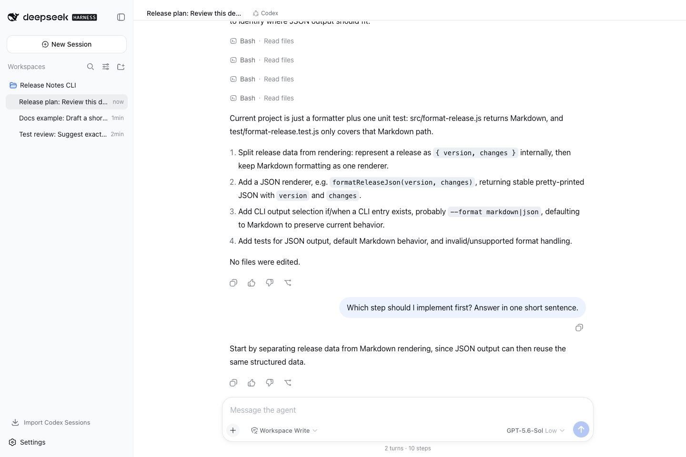
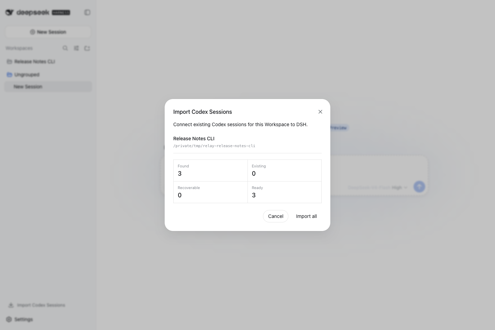
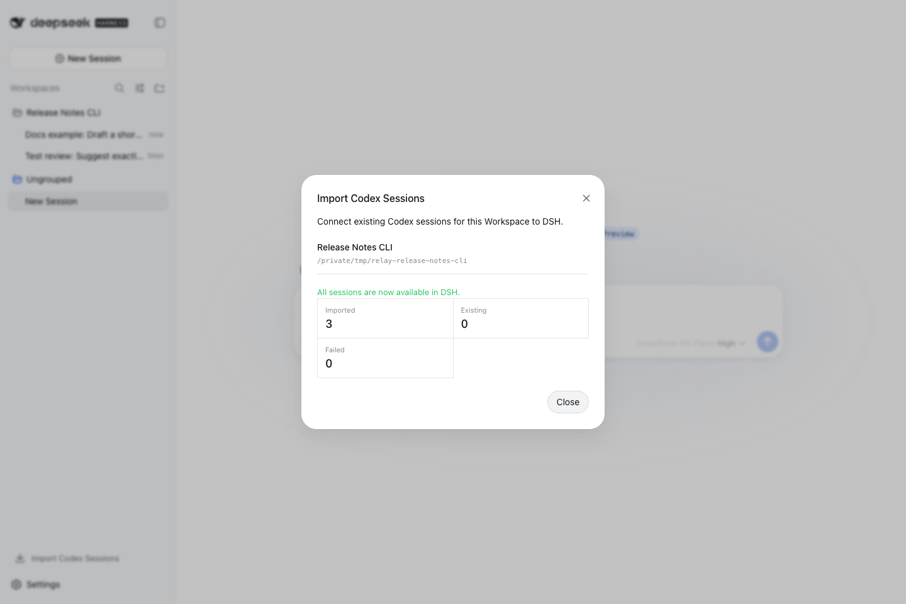
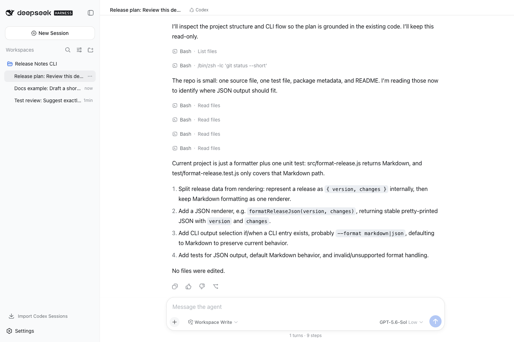

# Don't Start Over: Import Existing Codex Conversations into DeepSeek Harness

English | [中文](import-existing-codex-conversations-into-dsh.zh.md) | [Series index](dsh-agent-workbench-series.md)

I want to use DSH as the front door to a project. I do not want a new interface
to make me repeat every requirement, test idea, and implementation decision that
is already in Codex.

`relay-dsh-plugin-codex@0.1.1-rc.4` adds Workspace-level import. It finds the
Codex Threads that belong to a project and turns them into normal DSH Sessions.
Open one to read its history, then continue the same Thread.



This is not a mockup. The screenshot comes from official DSH `0.1.1-rc.2`, the
published npm plugin, and real Codex App Server conversations.

## Install the plugin

Stop the running DSH Web process, then install the npm prerelease:

```bash
dsh plugin --profile web add relay-dsh-plugin-codex@next
dsh web
```

`next` currently points to `0.1.1-rc.4`. Replace `@next` with
`@0.1.1-rc.4` when you need the exact version tested in this article.

You can also install the current development build from GitHub:

```bash
dsh plugin --profile web add \
  github:yangbobo2021/relay-dsh-plugin-codex#main
```

The plugin bundles a pinned official Codex App Server runtime for macOS,
Windows, and Linux, so it does not normally need a global `codex` command.
Codex authentication is still required. Start DSH as the same operating-system
user whose Codex profile contains the conversations you want to import.

## Import one Workspace at a time

Add or open the project Workspace in DSH, then select **Import Codex Sessions**
near the bottom of the sidebar. The plugin scans Codex conversations by project
path and shows the totals before it changes anything.



The current release imports the entire Workspace; it does not offer per-Thread
checkboxes. Select **Import all** to continue. This run found three conversations,
imported all three, and reported zero failures.



## Keep the useful titles and order

Imported Sessions show their Codex titles immediately and stay ordered by the
source activity time. You do not have to open every row to work out what it was.


The operation is idempotent. Running it again in this test produced `Found 3`,
`Existing 3`, and `Ready 0`, with no duplicate Sessions.

## Open the history and keep going

When an imported Session opens, the plugin performs one `thread/read` and adds
missing terminal user and assistant messages to DSH's presentation history.
The original answer, tool activity, model, and reasoning effort remain visible.



I then asked which step from the earlier four-step plan should come first. Codex
answered from that existing context instead of starting a blank conversation.
After switching to another Session and back, both turns were still present.

## What moves, and what does not

DSH stores normal presentation history plus a durable one-to-one binding between
the DSH Session and the Codex Thread. Codex App Server still owns model context,
tool state, and compaction. The plugin does not copy private Codex runtime records
into a second database.

Three limits are worth knowing:

- Import currently works on a whole Workspace, not selected Threads.
- A Session synchronizes once when it opens. There is no background polling or manual refresh action.
- One Codex Thread cannot have two App Server writers. Fully quit the Codex client or process that owns the Thread before continuing it in DSH.

The practical result is simple: adopting DSH does not mean abandoning work that
already happened in Codex. Native DSH, Codex, and Claude conversations can live
under one project, while each task still uses the backend that makes sense for
its quality, cost, and tool needs.

- [Codex plugin on GitHub](https://github.com/yangbobo2021/relay-dsh-plugin-codex)
- [npm package: relay-dsh-plugin-codex](https://www.npmjs.com/package/relay-dsh-plugin-codex)
- [Relay: multi-backend conversations and event-driven agent workflows](https://github.com/yangbobo2021/Relay)
- [Official DeepSeek Harness repository](https://github.com/deepseek-ai/deepseek-harness)
