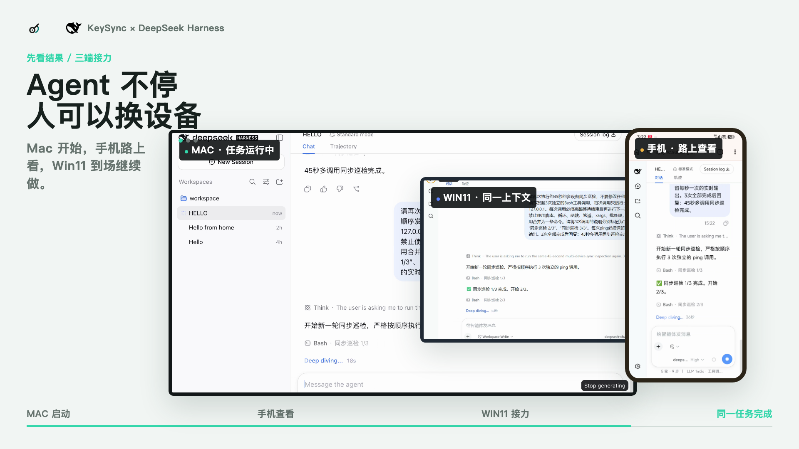
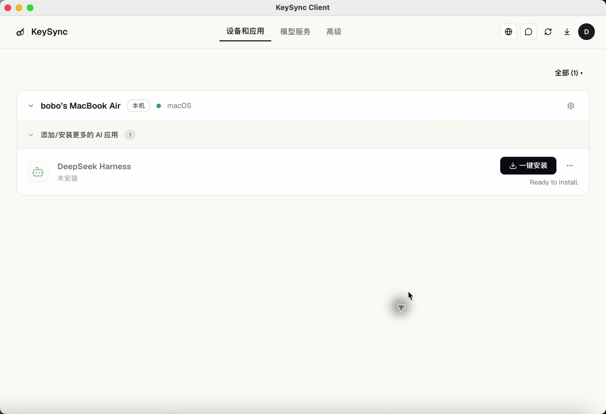
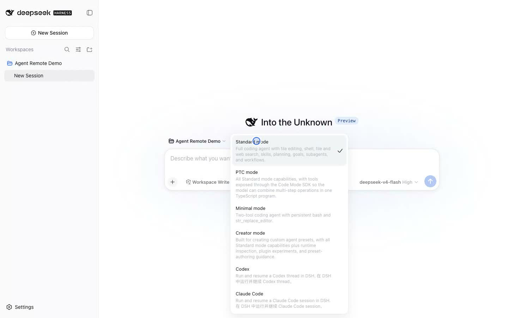
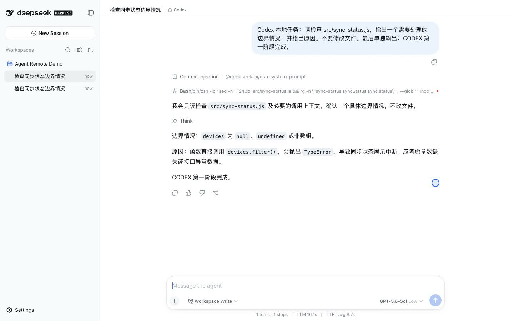
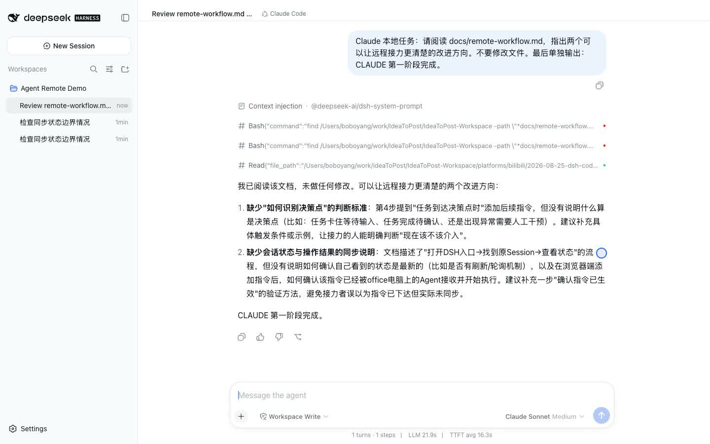
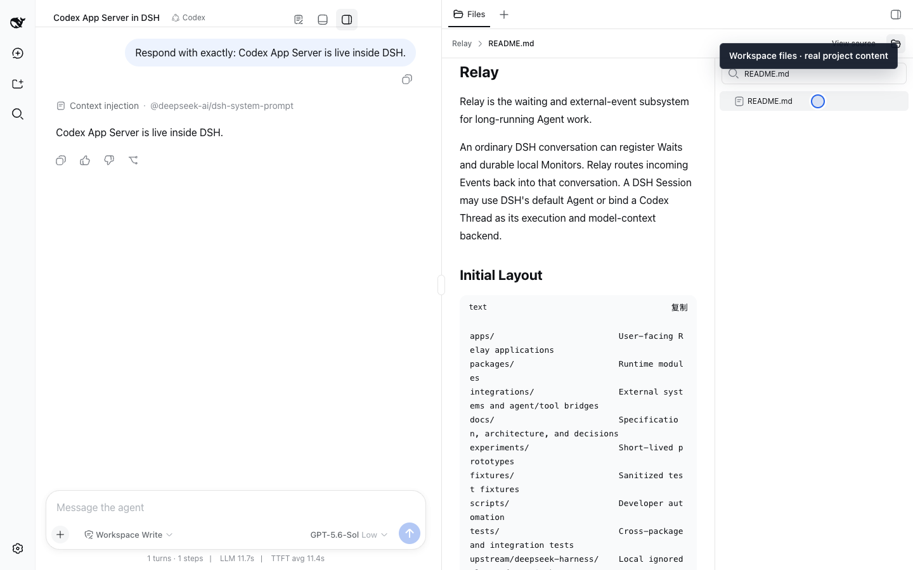
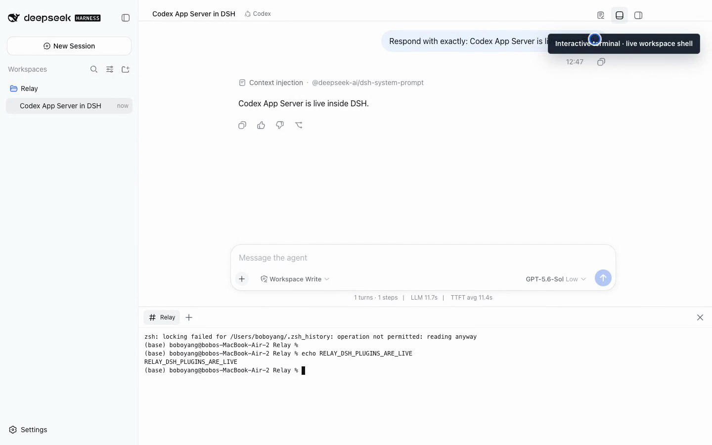
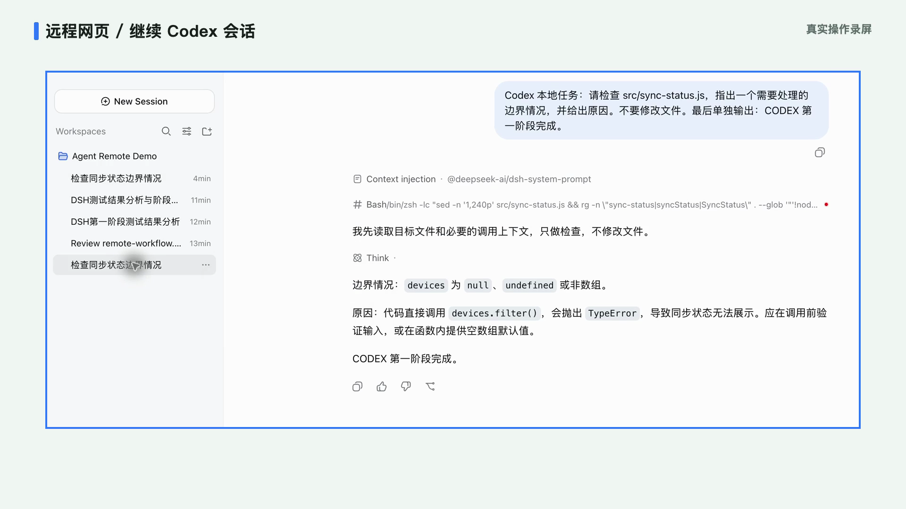

# 电脑没带走，AI 工作没停：我把 DSH、Codex 和 Claude 放进一个远程工作台

[English](keysync-dsh-multi-device-agent-workbench.md) | 中文

上次录 KeySync 视频时，我们拍了一个有点夸张的开场：人已经骑车下班，电脑还在车筐里跑 Agent。这个动作当然不建议模仿，但问题是真的：人离开工位以后，正在做的任务怎么办？

我需要的不是在手机上重新开一个聊天窗口，而是回到原来的项目、原来的会话，接着做。



_这是上一轮 DSH 原生会话的真实三端录屏合成：任务在 Mac 上运行，手机查看，Windows 接着操作。本文新增的 Codex 和 Claude
Code 也从同一个 DSH 入口进入，但各自使用独立会话。_

## 我为什么不只远程 DSH

因为真实工作里，我不会只用一种 AI。

我现在的习惯是：普通问题先用 DSH 原生模式；需要连续读代码、跑命令和修改文件时用 Codex；想换一种思路审查文档或方案时用 Claude
Code。这不是模型排名，只是按任务、价格和结果做选择。

问题也正出在这里。三种工具各有用处，历史记录却散在不同应用里；离开办公电脑后，还得分别解决远程入口。

我最后搭出的组合很直接：

- **KeySync** 在工作电脑上安装并运行官方 DSH，并提供访问这台电脑上 DSH Web
  UI 的远程入口。
- **Codex 和 Claude 插件**给 DSH 增加两种可选的会话后端。
- **Workbench、Files 和 Terminal 插件**把项目文件与终端放到对话旁边。

KeySync 一键安装 DSH 时会内置 Relay Plugin Manager，方便直接通过 Chat 管理
插件。其他 Relay 插件仍然按需通过 DSH 自己的插件机制加入。

## 第一步：安装官方 DSH

在 KeySync 的“设备和应用”里，DeepSeek Harness 有独立的一键安装入口。



_实机截图：KeySync 准备在当前 Mac 上安装 DeepSeek
Harness。这里安装的是官方 DSH，不是 Relay 维护的 Fork。_

安装好 DSH，再加入需要的插件。重启后，新建会话的模式列表里会保留 Standard
mode，同时出现 Codex 和 Claude Code。



_实机截图：官方 DSH `0.1.1-rc.2`
安装两个对话插件后的模式菜单。只装其中一个插件，就只增加对应选项。_

## 三个 Agent 放在一起，但不混在一起

我在同一个 Workspace 下建了三段会话：Codex 检查代码边界，Claude
Code 审查远程接力方案，DSH 原生模式分析测试结果。



_Codex 会话实录：工具调用、分析过程和回复都显示在这段 DSH 会话里。_



_Claude
Code 会话实录：它读取文档后给出两条改进意见，内容单独保存在自己的会话中。_

这三段会话可以并列放在同一个项目下，但不会自动共享上下文。想继续哪个，就打开哪个原会话。统一的是项目入口和管理方式，不是把三个 Agent 的记忆搅在一起。

## 对话旁边就是项目现场

只把聊天放在一起还不够。Agent 提到一个文件时，我希望马上看到；需要确认命令结果时，也不想再找另一个终端窗口。

Files 在右侧显示当前 Workspace 的目录树和文本预览。Terminal 在底部打开真实 Shell。Workbench 只负责承载这两个面板，本身不会读文件或启动命令。



_官方 DSH 实机截图：Files 正在预览 Relay 工作区的 `README.md`。_



_官方 DSH 实机截图：Terminal 在当前工作区执行
`echo`。画面保留了真实运行环境中的 zsh history 权限提示，没有用模拟输出替换。_

Terminal 是一个中立的界面，需要后端插件提供实际 Shell。本文这套组合里，Shell
provider 由 Codex 插件提供；Files 不依赖 Codex 或 Claude。

## 换了设备，打开的还是原会话

离开工作电脑后，我可以从另一台电脑的 KeySync 客户端，或手机、平板和电脑浏览器，打开这台工作电脑上的 DSH。

远程进入后不要新建会话。打开左侧原来的 Codex 会话，就能在上一轮代码检查后继续加约束；Claude
Code 和 DSH 原生会话也是同样的做法。



_真实远程录屏画面：浏览器重新打开原 Codex 会话，左侧仍是同一个 Workspace 和原有会话列表。外框与标题是为了说明录制环境添加的标注。_

这里有三个边界：

1. 项目、Shell 和 Agent 仍在工作电脑上运行，并没有搬到手机或云端。
2. 工作电脑必须保持开机、联网且不能进入会停止程序的深度睡眠；KeySync 和 DSH 也要保持运行。
3. 这是访问指定的 DSH Web
   UI，不是远程控制整台电脑。请只在设备所有者和所在组织允许的情况下使用。

## 安装命令

当前公开验证基线是官方 DSH
`0.1.1-rc.2`。下面这组命令会加入两种会话后端、右侧文件浏览和底部终端：

```bash
npx @deepseek-ai/dsh@0.1.1-rc.2 plugin --profile web add \
  relay-dsh-plugin-codex@next \
  relay-dsh-plugin-claude@next \
  relay-dsh-plugin-workbench@latest \
  relay-dsh-plugin-files@latest \
  relay-dsh-plugin-terminal@latest
```

如果只需要 Codex 或 Claude
Code，可以只安装对应插件。它们是独立 npm 包，不依赖 Relay
Events，也不用下载 Relay 仓库。Workbench 只在安装 Files 或 Terminal 这类面板插件时需要。

安装完成后重启 DSH；两个后端仍需在工作电脑上完成各自的正常账号登录。

截至 2026 年 8 月 26 日，Codex `next` 为 `0.1.1-rc.4`，Claude `next` 为
`0.1.1-rc.2`，Workbench、Files 和 Terminal 的 `latest` 均为
`0.1.0`。版本会继续更新，安装前可以在 npm 页面核对标签。

## 它现在是什么，不是什么

这套组合已经能解决四件具体的事：不用在 DSH、Codex 和 Claude 的独立界面之间来回找会话；同一项目的对话可以聚在一起；文件和终端留在对话旁边；离开工位后能从原会话继续。

它还不是多 Agent 自动编排。现在仍由人决定把任务交给谁。未来要做 Agent 之间的交接和协作，这套清楚的项目、会话和后端边界会是基础；但没做完的部分，我不打算写成已经存在。

对我来说，最大的变化很朴素：我仍然可以按成本、质量和任务类型选工具，只是不用每换一个工具，就换一个工作现场。

## 相关链接

- [下载 KeySync](https://sublang.ai/keysync/dl-dy)
- [DeepSeek Harness 官方仓库](https://github.com/deepseek-ai/deepseek-harness)
- [Relay 与全部 DSH 插件](https://github.com/yangbobo2021/Relay/blob/codex/relay-foundation/docs/dsh-plugins.zh.md)
- [Codex 插件](https://github.com/yangbobo2021/relay-dsh-plugin-codex) ·
  [Claude Code 插件](https://github.com/yangbobo2021/relay-dsh-plugin-claude)
- [Workbench](https://github.com/yangbobo2021/relay-dsh-plugin-workbench) ·
  [Files](https://github.com/yangbobo2021/relay-dsh-plugin-files) ·
  [Terminal](https://github.com/yangbobo2021/relay-dsh-plugin-terminal)
- [视频：KeySync 安装 DSH 与三端接力](https://www.bilibili.com/video/BV1pthK6TEa9/)
- [视频：把 Codex 和 Claude Code 接进 DSH](https://www.bilibili.com/video/BV1t2h36bE9H/)
- [小白教程：从安装到远程继续原会话](https://merico.feishu.cn/docx/HiSKd8V9qopI19x55aSchW8onHe)
