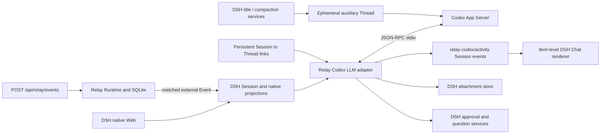

# Codex In Native DSH Web Design

This design implements the
[Codex in native DSH Web specification](../spec/codex-app-server.md).

Validated DSH revision: `fc18096c87fababb8429b51df655c22649f74e6f`.

## Runtime Composition

The installable DSH plugin and managed `relay-codex` preset are started by
`scripts/start-relay-web.sh`. There is no Relay-owned conversation page.

## Ownership

| Concern | Owner |
| --- | --- |
| Workspace, Session list, title, Chat/Trajectory, composer, input queue | DSH |
| Model context, turns and tool execution | Codex Thread |
| DSH Session to Codex Thread binding | `CodexLinkStore` |
| Codex activity presentation audit | DSH Session log |
| Images shown in transcript | DSH attachment store |
| Approval and user questions | DSH interaction services |
| Wait, Event, Delivery and Activation | Relay SQLite |

## Native Extension Strategy

DSH's own `conversation.hero.agentPreset` lists the managed Codex preset. Relay does
not register a replacement hero, view, header, Session body, or composer.

When a blank Session selects Codex, a small client coordinator selects the
`relay-codex` provider's default model through DSH's normal `session.selectModel`
API. From then on the shipped model selector owns model and reasoning effort. DSH's
permission preset remains the sole sandbox/approval control. The Host maps those
native values to App Server turn parameters.

The Host directly intercepts ordinary `llm/stream` calls for Sessions whose effective
preset is `relay-codex`; registered-provider routing delivers Codex purpose calls to
the same adapter, while non-Codex Sessions pass through. The adapter streams App
Server reasoning and agent-message deltas as normal DSH chunks,
so the existing Assistant renderer and Trajectory projection remain authoritative.
For an ordinary turn it forwards only the latest user-authored message. For an
inbox activation it forwards only the latest plugin message whose source is exactly
`relay`; unrelated DSH context injections never become Codex user input.

DSH automatic title and compaction requests carry `purpose`. The adapter routes each
one to a fresh unlinked App Server Thread with `ephemeral: true`, a read-only sandbox,
`never` approval, an empty Relay dynamic-tool set, and purpose-scoped instructions
that prohibit tool use. It streams only reasoning/text blocks back to the requesting
DSH service, never appends `relay-codex/activity`, then unsubscribes and removes the
temporary Thread from the runtime. The Session-to-Thread link store is never touched.
Consequently title work can overlap a business turn without sharing a queue or model
context. DSH's deterministic fallback remains authoritative when title generation
fails.

## Codex Activity Events

Tool-like App Server items have no truthful DSH tool execution counterpart. The
adapter therefore appends presentation-only `relay-codex/activity` events at item
start and completion. Their payload is a bounded normalized snapshot: item identity,
kind, title, summary, status, optional input/output, and no credentials or absolute
image data.

The client registers one Conversation Event definition and one keyed Chat node
renderer. It renders a compact disclosure row with DSH primitives and a terminal
body for command output. Expanded rows also identify Codex App Server and show short
Thread/Turn identifiers, with full identifiers available as hover text. This gives
the user execution provenance without adding diagnostic chrome. The renderer is
additive inside the existing Chat flow; it does not own a view. Events persist in the
DSH Session, so switching or reopening reconstructs the same rows without polling
Codex.

DSH rc.5 has no downstream event-type registration API although persistence checks a
shared known-type set. The Host installs a narrow compatibility shim for
`relay-codex/activity` before any Session is opened and fails startup if the set is
not extensible. The shim is covered by cold-resume tests and remains pinned to the
validated DSH revision.

## Images And Interactions

When an image item completes, the Host resolves and reads it only from the Session
workspace or Codex generated-image root, validates it through `ctx.attachments`, and
yields a normal assistant image block. DSH stores and serves the bytes by opaque
attachment ID; the browser never reads a local path.

App Server server requests are routed by the bound Thread to the owning live Agent.
Command/file/permission requests call `ctx.approval.request`; tool-input requests call
`ctx.userQuestions.ask`. The result is converted back to the exact App Server response
shape. Missing Session ownership or unsupported requests fail closed.

## Relay Delivery

Codex waits use the owning DSH Session ID as Relay's runtime identity. An external
connector or agent capability registers the Wait; the conversation contains no
manual Event UI. Matched Events follow Relay's normal routing and enqueue one bounded
`relay_external_events` envelope through `DshInboxAdapter`. DSH preserves ordinary
inbox ordering and the next adapter call continues the bound Thread. The path does
not touch Codex Automations or any timer scheduler.

External systems submit Events to the exact DSH Web route
`POST /api/relay/events`. The ingress accepts `application/json` with a required
`type`, optional `source`, `source_event_id` and `fingerprint`, and arbitrary bounded
payload fields. It creates a stable SHA-256 fingerprint when the caller omits one.
Loopback callers need no credential so local integrations work out of the box;
non-loopback callers must send `Authorization: Bearer <RELAY_INGRESS_TOKEN>`. The
response is emitted only after `RelayRuntime.handleEvent` returns and includes the
durable Event and Delivery states. Runtime failures return 5xx and never masquerade
as malformed client Events.

## Requirement Mapping

| Requirements | Implementation |
| --- | --- |
| `CXS-001` - `CXS-006` | DSH preset, adapter interception, persistent link store |
| `CXS-007` - `CXS-011` | Native DSH surfaces plus item-level activity definition |
| `CXS-012` - `CXS-014` | DSH attachments/interactions and push streaming |
| `CXS-015` - `CXS-020` | Relay runtime delivery and authenticated Event ingress with no manual conversation controls |
| `CXS-021` - `CXS-023` | failure handling, compatibility tests, native browser QA |
| `CXS-024` - `CXS-025` | isolated ephemeral auxiliary Threads and activity provenance |
