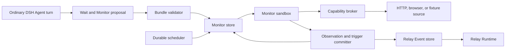

# Initial Monitor Runtime Design

## Prototype Boundary

The first Monitor runtime is a local SQLite scheduler for Session-authored, bound
polling Monitors. The implemented slice uses injected fixture observers and built-in
detectors rather than generated JavaScript or customer credentials, then feeds
triggered Events into the existing Relay Runtime.

The slice proves registration, state comparison, deterministic delivery, recovery,
and lifecycle semantics. It does not yet execute a real customer browser profile or
claim that generated JavaScript is safely sandboxed for production.

## Implementation Status

SQLite schema version 4 implements Monitor registrations, immutable versions,
leased checks, observations, triggers, and their Event links. An Agent can propose a
Monitor with a new Wait; Relay captures a baseline before committing both. Baseline
failure leaves the waiting projection in its prior state with no new Wait or
Monitor.

The runtime currently supports deterministic `field_transition` and `unseen_items`
detectors, one-shot completion, explicit recurring rearm, cancellation when an
owning Wait ends, and terminal `monitor.failed` wakeups that preserve the business
Wait. The next implementation gate is the sandbox and capability broker; generated
observer code, browser profiles, network access, jitter, expiration, and offline
source catch-up are not implemented.

## Runtime Shape



## Target Generated Bundle

The target registration shape is:

```json
{
  "monitor_id": "monitor-po-1042",
  "wait_id": "wait-po-1042-approval",
  "mode": "poll",
  "schedule": {
    "interval_seconds": 60,
    "jitter_seconds": 5
  },
  "behavior": {
    "one_shot": true,
    "fire_on_initial_match": false
  },
  "artifact": {
    "entrypoint": "monitor.mjs",
    "sha256": "content-addressed-hash"
  },
  "capabilities": {
    "browser_profile": "customer-a-readonly",
    "allowed_origins": ["https://procurement.customer.example"]
  },
  "retry": {
    "max_consecutive_failures": 3,
    "backoff_seconds": [30, 120, 600]
  },
  "expires_at": "2026-09-01T00:00:00Z"
}
```

The Session identity is taken from the authenticated Agent tool context, not accepted
from generated Monitor code.
The artifact is copied into Relay-owned content-addressed storage before validation;
a later project edit cannot mutate an active version.

The future generated module has two logical entrypoints:

```js
export async function observe(context) {
  const page = await context.browser.open("/approvals/PO-1042");
  return { approval_id: "PO-1042", status: await page.text("[data-status]") };
}

export function detect(previous, current) {
  return previous?.status !== "approved" && current.status === "approved"
    ? [{ type: "procurement.approved", key: `PO-1042:${current.status}`, data: current }]
    : [];
}
```

`observe` can use only brokered context methods. `detect` receives JSON values and
has no capabilities. Proposed Events are validated against size and shape limits
before commit.

## Storage Model

| Table | Purpose | Important fields |
| --- | --- | --- |
| `monitors` | Registration, ownership, scheduling, and lease | `id`, `session_id`, `wait_id`, `state`, `active_version`, `next_check_at`, `lease_owner`, `lease_expires_at` |
| `monitor_versions` | Immutable bundle and policy | `id`, `monitor_id`, `artifact_hash`, `manifest`, `created_at` |
| `monitor_checks` | One validation or scheduled attempt | `id`, `monitor_id`, `version_id`, `state`, `started_at`, `finished_at`, `error_class`, `error` |
| `observations` | Compact successful source state | `id`, `check_id`, `monitor_id`, `sequence`, `state_hash`, `data`, `observed_at` |
| `monitor_triggers` | Idempotent link from detection to Event | `id`, `monitor_id`, `check_id`, `trigger_key`, `event_id`, `created_at` |

`monitor_id` plus `trigger_key` is unique. One Monitor has at most one running check.
Only one Monitor version is active, while all versions and checks remain inspectable.

The existing `events`, `deliveries`, and `delivery_waits` tables remain the source of
truth after a trigger is emitted. Monitor tables do not duplicate routing or Agent
outcomes.

## Registration Transaction

The Agent may submit proposed Monitors with replacement Waits. The registration path:

1. validates manifest structure and that each registration names a proposed Wait;
2. prepares an immutable version record for the validated proposal;
3. runs the first Observation outside a database transaction through the injected
   observer boundary;
4. validates and hashes the baseline Observation; and
5. atomically replaces old Waits, inserts the baseline, and
   activates each new bound Monitor and Wait.

Any validation or baseline failure rejects the replacement registration. The
conversation does not rely on a Wait whose only observation mechanism failed to
activate. Artifact storage and sandbox execution replace the injected observer at
the next implementation gate without changing this transaction contract.

## Scheduled Check

The scheduler queries due `active` or retryable `degraded` Monitors. A short
transaction leases one Monitor, records a running MonitorCheck, and snapshots its
version and last Observation. Observation and detection run outside the transaction.

A successful commit transaction verifies the lease, Monitor version, owning Wait,
and prior Observation sequence. It then stores the new Observation and check result.
When detection returns proposed Events, the same transaction also:

- inserts idempotent MonitorTrigger and Event records;
- commits a deterministic routing decision and Delivery to the bound Session;
- claims the bound Wait; and
- completes a one-shot Monitor or moves a recurring Monitor to `triggered` with no
  next check.

After processing the Event, the Agent may rearm a recurring Monitor by binding it to
a newly registered Wait. Rearming preserves the last Observation and atomically moves
the Monitor back to `active`; replaying the state that caused the previous trigger
therefore emits nothing.

A stale version, ended Wait, or changed Observation sequence discards the proposed
result. Duplicate trigger keys return the previously committed Event without another
Delivery.

## Scheduling and Recovery

One local worker uses persisted `next_check_at` values rather than one operating
system timer per Monitor. It sleeps until the earliest due time and also scans after
startup, wake-from-sleep, clock changes, and worker errors.

Expired check leases become retryable. Retry delay follows the Monitor policy and is
capped globally. Normal schedules include stable per-Monitor jitter so many Monitors
do not check at the same instant.

For overdue Monitors, the source adapter declares whether it supports incremental
catch-up, current-state comparison, or neither. The scheduler records that recovery
class in the check instead of implying that every missed transition can be rebuilt.

## Failure and Repair

Each failed check records a stable error class such as `authentication`,
`contract_changed`, `capability_denied`, `timeout`, `invalid_observation`, or
`source_unavailable`. Transient failures reschedule without changing the last good
Observation.

After the configured consecutive-failure threshold, the Monitor enters `degraded`.
After its terminal threshold, Relay emits one bound `monitor.failed` Event with the
error class, sanitized diagnostics, artifact version, and last successful check. The
failure Delivery has no matched Wait, so it wakes the owner without claiming the
business condition. The Agent can produce a replacement bundle in a later turn.
Repair never edits an active artifact in place.

## Sandbox Boundary

Generated code and observed page content are untrusted. A plain Node `vm` or a child
process running with the user's normal permissions is not a security boundary.

The production boundary requires an isolated runtime with CPU, memory, wall-clock,
output, and capability limits. The sandbox receives no environment variables,
filesystem mounts, network stack, browser credentials, or database handle. A host
broker performs allowed HTTP or browser reads and returns bounded structured data.

The fixture prototype uses a fake broker and deterministic observer artifacts. A
real browser adapter is blocked on proving this sandbox and credential-broker
boundary. Browser actions remain read-only, with navigation and origins checked by
the broker rather than trusted to generated code.

## Validation Fixtures

Executable cases live under
[`fixtures/trigger-monitoring`](../../fixtures/trigger-monitoring/README.md):

- `approval_status_transition` proves baseline, one-shot transition, bound delivery,
  and duplicate suppression;
- `new_collection_item` proves recurring unseen-item detection and rearming; and
- `page_contract_failure` proves retries, degraded state, and visible terminal
  failure instead of silent loss.

The first implementation gate requires exact Event identities, Monitor states, Wait
effects, and duplicate counts for all three cases. It must also reject an artifact
that requests an undeclared origin or attempts direct host access.
