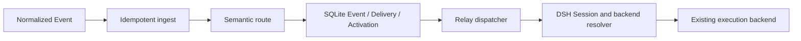

# Runtime Design

This document maps the [Runtime Specification](../spec/runtime.md) to the SQLite
prototype. Product requirements remain in the specification.

## Data Flow

Agent turns independently call `registerWaits` or `cancelWaits`. `RelayRuntime`
starts no Agent itself; it delegates accepted Activations to a backend adapter.

## Storage Projection

| Record | Purpose |
| --- | --- |
| `sessions` | Relay waiting projection keyed by a runtime-qualified backend ID and linked to a DSH Session |
| `waits` | Active and historical matching cards |
| `monitors` and related tables | Durable observation state and trigger history |
| `events` | Idempotent normalized external input |
| `routing_attempts` / `routing_decisions` | Inspectable model work and one committed disposition |
| `deliveries` / `delivery_waits` | Event assignment and matched Waits |
| `activations` | Stable per-Session Delivery batch and dispatch lease |

`runs` and execution-oriented Session fields remain migration-era storage in schema
version 4; the public runtime no longer creates Runs or treats them as conversation
state. A later schema compaction may remove them after migration compatibility is no
longer needed.

## Transactions

Ingestion inserts or returns one Event by provider identity/fingerprint. Routing runs
the model outside SQLite, then checks Event version, candidate versions, and a global
routing epoch before atomically storing the decision, Deliveries, and Wait claims.

Dispatch creates or reuses one active Activation and leases only that record. The
backend call runs outside SQLite. Success atomically commits the Activation, resolves its
Deliveries and Events, consumes matched Waits, and ends bound one-shot Monitors.
Failure releases the dispatch lease and preserves the same Activation for retry.

Wait registration supersedes the previous live set, validates prepared Monitors, and
activates the replacement set in one transaction. Recurring Monitor rearm IDs are
explicit so unrelated old Monitors are cancelled.

## DSH And Backend Adapters

`DshInboxAdapter` receives the Host's shared resolver, which reuses a live Agent and
deduplicates cold resume. It sends a plugin-sourced `followup()` containing a bounded,
untrusted Event envelope and waits for the Host's acceptance boundary. It never calls
`ctx.agents.create()`, owns no Session lease, and does not dispose the Agent.

The stable Activation ID is part of the envelope. Full crash reconciliation still
requires the Host composition to define a durable inbox acknowledgement and external
action tools to honor idempotency keys.

The Codex adapter is defined separately in the
[Codex in DSH Web design](codex-app-server.md). DSH remains the visible Session; the
adapter resumes its bound Thread and uses successful `turn/start` as the acceptance
boundary.
