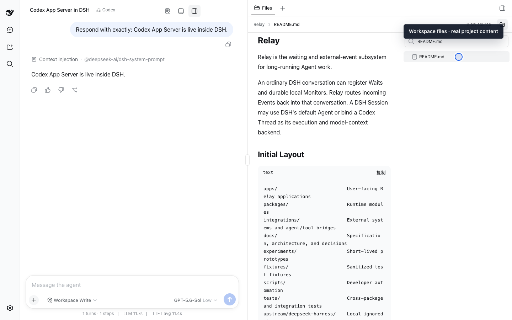

# Relay Plugins for DeepSeek Harness

English | [中文](dsh-plugins.zh.md)

> **Relay maintains 10 DSH plugins. Workbench, Files, and Terminal were retired
> on 2026-09-15 and will not be adapted to newer DSH releases.** Their `0.2.2`
> releases remain available only for historical DSH `0.1.2` installations.

The 10 maintained plugins pass isolated, key-combination, and full-composition
verification on both official DSH `0.1.5-rc.2` (tag commit
`fb2c4b9e698e30edb738bca4cf0618587db7d203`) and `0.1.6-alpha.1` (tag commit
`0a15e36e7f82b6ed45af6fa9759f29b40dcd965d`). Codex, Claude, and Events received
targeted compatibility updates for the newer stream, settlement, persistence,
and client-state contracts; the nine packages with DSH peers include both exact
releases in their declared ranges. [Read the latest compatibility evidence](../dsh-lab/dsh-0.1.6-alpha.1-20260915/README.md).

Discover and manage plugins from a conversation, or add Codex, Claude Code, and
Relay's asynchronous event capabilities to the official DeepSeek Harness. Use
official DSH for layout, workspace files, document preview, and terminal access.
No DSH fork or core patch is required.



The screenshot shows a live Codex App Server reply beside the Files view on a
clean official DSH `0.1.1-rc.2` profile. The same real run, from an actual npm installation,
also verified a live Claude Agent SDK reply and a Terminal command in the Relay
workspace.

[Watch Plugin Manager install Codex in 40 seconds](media/dsh-plugin-manager-codex-install-demo.en.mp4?raw=1) ·
[Open the full-size live screenshot](media/dsh-plugin-suite-live.png) ·
[Read the recording and compatibility evidence](acceptance/dsh-plugin-demo-qa.md)

## Choose What You Need

| Goal | Install | Notes |
| --- | --- | --- |
| Find, install, update, or remove DSH plugins through Chat | [`relay-dsh-plugin-manager`](https://github.com/yangbobo2021/relay-dsh-plugin-manager) | Searches npm and GitHub; every mutation requires separate confirmation, and Settings remains read-only help. |
| Start Codex conversations in DSH | [`relay-dsh-plugin-codex`](https://github.com/yangbobo2021/relay-dsh-plugin-codex) | Independent backend powered by Codex App Server. |
| Start Claude Code conversations in DSH | [`relay-dsh-plugin-claude`](https://github.com/yangbobo2021/relay-dsh-plugin-claude) | Independent backend powered by Claude Agent SDK. |
| Browse workspace files | Official DSH Files and document preview | The Relay Workbench and Files plugins are retired. |
| Open a terminal panel | Official DSH interactive sidebar terminal | The Relay Workbench and Terminal plugins are retired. |
| Build another side or bottom view | Official DSH layout/sidebar extension surfaces | Do not build against the retired Workbench contract. |
| Import existing provider sessions | [`relay-dsh-plugin-session-import`](https://github.com/yangbobo2021/relay-dsh-plugin-session-import) | Shared import surface used by the Codex and Claude providers. |
| Receive external events in an existing DSH Session | [`relay-dsh-plugin-events`](https://github.com/yangbobo2021/relay-dsh-plugin-events) | Durable Wait, Event, and Delivery runtime. |
| Watch systems that cannot push events | Events + [`relay-dsh-plugin-monitors`](https://github.com/yangbobo2021/relay-dsh-plugin-monitors) | Runs restricted durable monitors and emits normal Relay Events. |
| Wait for a durable deadline | Events + Monitor Core + [`relay-dsh-plugin-monitor-time`](https://github.com/yangbobo2021/relay-dsh-plugin-monitor-time) | Adds the discoverable `time.deadline` Bundle Type and timer tool. |
| Wait for a process to exit | Monitor Core + [`relay-dsh-plugin-monitor-process`](https://github.com/yangbobo2021/relay-dsh-plugin-monitor-process) + [`relay-dsh-plugin-monitor-author`](https://github.com/yangbobo2021/relay-dsh-plugin-monitor-author) | Issues an opaque Process Handle, then authors a least-authority Session-scoped Bundle. |
| Create a temporary custom Monitor | Monitor Core + Monitor Author + the required capability plugin | Lists installed types first; custom code is a restricted fallback, not the default. |
| Route events with a DSH model | Events + [`relay-dsh-plugin-semantic-router`](https://github.com/yangbobo2021/relay-dsh-plugin-semantic-router) | Optional semantic routing for `deliver`, `escalate`, or `dismiss`. |

Plugin Manager, Codex, and Claude do not depend on the Relay runtime or the
retired workspace UI plugins. Relay Events is a separate optional runtime and is
not required by these plugins.

The retired repositories remain readable as historical implementations, but
they are excluded from current presets, installation recommendations, releases,
and newer-DSH compatibility testing. Historical `0.1.2` evidence may remain.

Install the conversation-first manager by itself, restart DSH once, then use
`/plugins` or an ordinary natural-language request:

```bash
npx @deepseek-ai/dsh@0.1.6-alpha.1 plugin --profile web add --save-exact \
  relay-dsh-plugin-manager@0.2.2
```

```text
/plugins find a plugin for Feishu
list installed plugins and whether DSH needs a restart
```

## Install From npm

The established plugins use `0.2.2`. The extensible Monitor runtime is `0.3.1`;
Time, Process, and Author use `0.1.1`. Pin exact versions in production.

```bash
pnpm dlx @deepseek-ai/dsh@0.1.6-alpha.1 plugin --profile web add \
  relay-dsh-plugin-manager@0.2.2 \
  relay-dsh-plugin-codex@0.2.2 \
  relay-dsh-plugin-claude@0.2.2 \
  relay-dsh-plugin-session-import@0.2.2 \
  relay-dsh-plugin-events@0.2.2 \
  relay-dsh-plugin-monitors@0.3.1 \
  relay-dsh-plugin-monitor-time@0.1.1 \
  relay-dsh-plugin-monitor-process@0.1.1 \
  relay-dsh-plugin-monitor-author@0.1.1 \
  relay-dsh-plugin-semantic-router@0.2.2

pnpm dlx @deepseek-ai/dsh@0.1.6-alpha.1 web
```

Install only the rows you need. Do not add Relay Workbench, Files, or Terminal
to a current profile; use the corresponding official DSH capabilities.

KeySync's one-click DSH setup already installs Plugin Manager. Do not add it a
second time there; the npm command is for standalone official DSH Profiles.

## Install From GitHub

Use GitHub installs to test the newest unreleased code. Pin a tag or commit SHA
for reproducible environments instead of leaving `#main` in production.

```bash
pnpm dlx @deepseek-ai/dsh@0.1.6-alpha.1 plugin --profile web add \
  github:yangbobo2021/relay-dsh-plugin-manager#main \
  github:yangbobo2021/relay-dsh-plugin-codex#main \
  github:yangbobo2021/relay-dsh-plugin-claude#main \
  github:yangbobo2021/relay-dsh-plugin-monitor-time#v0.1.1 \
  github:yangbobo2021/relay-dsh-plugin-monitor-process#v0.1.1 \
  github:yangbobo2021/relay-dsh-plugin-monitor-author#v0.1.1
```

Restart DSH Web after installing, updating, or removing plugins.

## Verify the Installation

```bash
dsh plugin --profile web why relay-dsh-plugin-codex
dsh plugin --profile web why relay-dsh-plugin-claude
dsh plugin --profile web why relay-dsh-plugin-manager
dsh plugin --profile web why relay-dsh-plugin-monitor-time
dsh plugin --profile web why relay-dsh-plugin-monitor-process
dsh plugin --profile web why relay-dsh-plugin-monitor-author
```

Then open a new DSH session. Ask to list installed plugins, or open **Settings >
Plugins > Plugin marketplace** for concise usage help. Codex and Claude Code
should appear in the mode menu. Workspace Files and Terminal come from official
DSH.

The 10 maintained plugin repositories include English and Chinese setup and
verification documentation. The former 13-plugin walkthrough is retained as a
[historical account of the original plugin suite](articles/no-fork-dsh-plugins.md),
not as current installation guidance.

The Codex plugin also treats App Server reliability as a product contract: its
Settings status distinguishes startup, connection, runtime availability, and
rebind failures; blank-session model selection follows the chosen backend;
normal forks use App Server `thread/fork`; and invalid fork provenance or stale
approvals fail closed without silently creating a replacement Codex Thread.

For the working model rather than package structure, read the
[Turning DSH into a Multi-Agent Project Workbench series](articles/dsh-agent-workbench-series.md):
it starts with task choice across native DSH, Codex, and Claude, then covers App
Server, Claude Sessions, the project Workbench, and the boundary for future
coordination.

For the complete multi-device run, read
[Leave the Work PC Running](articles/keysync-dsh-multi-device-agent-workbench.md):
KeySync installs official DSH with Plugin Manager built in; optional plugins add
conversation backends and Relay event capabilities, while Files and Terminal are
provided by official DSH.
