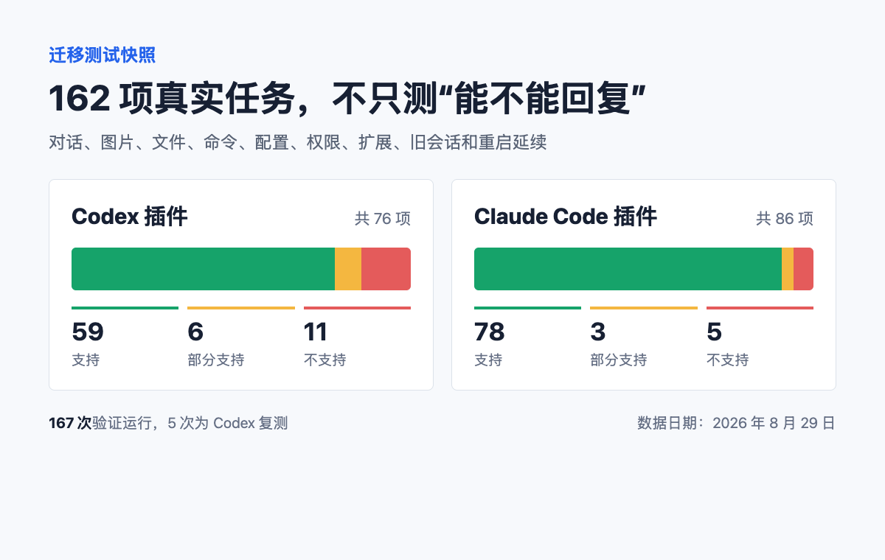
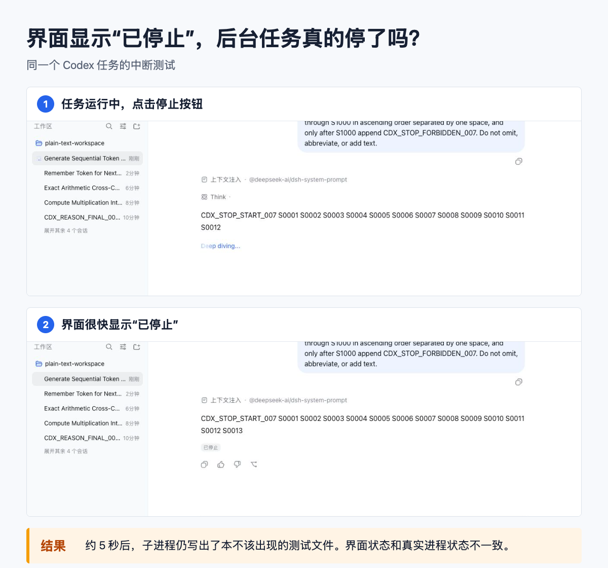

# 能聊天就算迁移成功？我们把 Codex 和 Claude Code 测了 162 项

一张图片已经出现在聊天窗口里，AI 却完全没有收到它。

一个运行中的任务点了“停止”，界面也显示停下来了，后台进程却又继续写出了文件。

如果只看界面，这两次操作都像是成功的。可一旦把它们放进真实项目，结果就可能完全不同。

这也是我们把 Codex 和 Claude Code 接入 DeepSeek Harness 后，没有停在“能正常回复”这一步，而是继续做了 162 项迁移测试的原因。

## 先用大白话说清楚：我们在迁移什么

DeepSeek Harness，下面简称 DSH。你可以把它理解成一个统一的 AI 工作页面：在同一个项目入口里查看对话、文件和工具，不必总在几个应用之间来回寻找记录。

Codex 和 Claude Code，都是可以帮助用户读代码、改文件、运行命令和处理项目任务的 AI 编程工具。

我们维护了两个 DSH 插件。插件可以理解成给 DSH 增加新能力的小组件：安装后，可以直接在 DSH 中新建 Codex 或 Claude Code 对话，也可以继续使用 DSH 的项目和历史界面。

但这不等于 DSH 已经变成了 Codex 或 Claude Code 的完整替代品。

能发出一句话、收到一句回答，只能证明最短的通路接上了。真正的迁移还要回答更多问题：

- 图片真的送到了 AI，还是只显示在页面上？
- 长命令运行时，能不能及时看到进度？
- 点击停止后，后台工作是否真的结束？
- 重启页面或服务后，原来的对话还能不能接着用？
- 项目中的配置和扩展是否仍然生效？
- 工具用过的敏感信息，会不会被写进本地记录？

这些问题平时不显眼，却决定了一个工具能不能进入日常工作。

## 162 项测试，不是为了凑一个好看的通过率

我们把真实开发工作拆成了 162 项可以单独判断的能力：Codex 76 项，Claude 86 项。

测试范围包括多轮对话、图片和文件、代码修改、命令运行、测试与 Git、项目配置、权限、扩展工具、旧会话导入、服务重启和长对话延续。

截至 2026 年 8 月 29 日，162 项都得到了结果，共保留 167 次验证运行。多出的 5 次，是 Codex 对部分问题的复测，不会重复计算。

| 插件 | 支持 | 部分支持 | 不支持 |
| --- | ---: | ---: | ---: |
| Codex | 59 | 6 | 11 |
| Claude Code | 78 | 3 | 5 |

这里必须强调：**这是 8 月 29 日发现问题时的快照，不是当前版本的通过率。**

8 月 30 日发布的 Codex 插件 `0.1.3` 和 Claude 插件 `0.1.4` 已经修复了其中多项问题。新的完整数字，要等 162 项再次跑完后才能更新。

比数字更重要的，是失败到底暴露了什么。

## 第一个问题：页面看见了，不代表 AI 收到了

测试中，我们把图片上传到 DSH。页面可以正常显示图片，附件顺序也没有错，但检查 Codex 的实际运行记录后发现：图片没有进入模型输入。

从用户视角看，这个问题非常隐蔽。你可能以为 AI 看过截图，只是理解错了；实际上，它从一开始就没有拿到图片。

这次失败推动我们补上了 Codex 图片传输。它也提醒我们：迁移测试不能只看最终页面，还要检查信息是否真正穿过了每一层。

## 第二个问题：“已停止”必须是真的停止

另一次测试让 Codex 启动一个会延迟写文件的任务，然后在 DSH 中点击停止。

界面很快显示任务已经停止，相关会话也记录了中断。但几秒后，子进程仍然写出了本不应该出现的文件。

这比没有停止按钮更危险。没有按钮时，用户至少知道任务还在运行；界面明确说“已停止”，用户就可能放心地关闭页面、修改文件，甚至执行另一项会冲突的操作。

因此后续修复不只改变界面状态，还要找到这次任务真正启动的后台进程，确认它已经结束。如果无法确认，就应该明确报告失败，而不是假装取消成功。

## 第三个问题：聊天里没出现，不代表磁盘上没有

我们还专门检查了敏感信息。

测试没有使用真实密码，而是放入可以追踪的假值。结果发现：这些值虽然没有出现在正常聊天内容中，却存在进入 Codex Shell 快照和 Claude 工具结果记录的路径。

这类问题很容易被普通功能测试漏掉，因为页面看起来完全正常。

Codex `0.1.3` 默认关闭了持久 Shell 快照；Claude `0.1.4` 在工具结果写入历史前增加了敏感环境变量值脱敏。

但这不等于所有敏感信息都自动安全。用户仍然应该遵守最小权限，不把真实密码直接发给 AI，也不要默认第三方工具的每条记录都会被自动清理。

## 测试的价值，是让下一版真的发生变化

8 月 29 日的报告没有被放进文档后就结束。

第二天发布的两个版本，直接处理了图片输入、长命令输出、任务中断、敏感值持久化和旧会话导入等问题。

我们的做法很简单：

1. 先在真实项目里使用插件；
2. 把遇到的问题变成可以重复执行的测试；
3. 修复 DSH 与 Codex、Claude Code 之间的连接边界；
4. 重新运行测试，并保留仍未解决的部分。

这比列一张“支持聊天、支持工具、支持图片”的功能表慢很多，但更接近用户真正关心的结果：我原来能完成的任务，换一个入口后还能不能继续完成？

## 你要不要迁移？先看自己的高频任务

如果你主要使用文字对话、读写项目文件、运行普通测试、查看 Git 状态，或者希望把几个 AI 工具放进同一个项目入口，可以先用一个不重要的项目试用。

如果你的工作高度依赖图片、文档上传、长时间命令、审批流程、旧会话导入或敏感环境变量，就不要只看一段成功视频。先确认当前版本是否明确支持，再用自己的真实流程做一次小范围验证。

如果你并不需要统一入口，在 Codex 或 Claude Code 原生工具里已经工作顺畅，也完全没有必要为了“迁移”而迁移。

最实用的方法，是先写下自己的 5 个高频动作，例如：

1. 上传一张报错截图，让 AI 解释；
2. 运行测试并观察中间进度；
3. 中断一个可能修改文件的任务；
4. 重启后继续昨天的对话；
5. 导入一个已有会话并继续工作。

这 5 项都验证通过，再把更重要的项目交给新入口。

## 最后说清楚边界

两个插件已经能覆盖主要的文字对话、编码、配置、扩展和会话延续路径，但它们仍不是 Codex 或 Claude Code 原生产品的完整复制品。

旧的 162 项数字不能代表 8 月 30 日新版本的现状；新版本也不能因为修复了几个重点问题，就被直接宣传为“全部兼容”。

我们会继续保留验证用例、运行记录和支持矩阵。因为对长期使用来说，最重要的不是发布当天能录出一段成功视频，而是几个月后仍然知道：哪里能用，哪里还需要小心。

相关链接：

- [Codex 插件](https://github.com/yangbobo2021/relay-dsh-plugin-codex)
- [Claude Code 插件](https://github.com/yangbobo2021/relay-dsh-plugin-claude)
- [DeepSeek Harness 官方项目](https://github.com/deepseek-ai/deepseek-harness)
- [Relay 项目](https://github.com/yangbobo2021/Relay)

