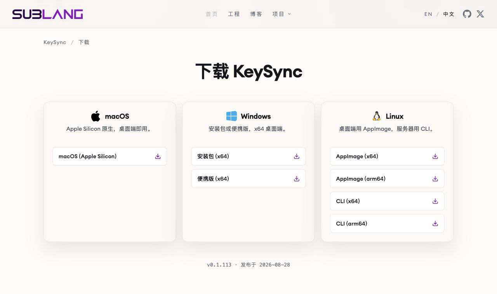
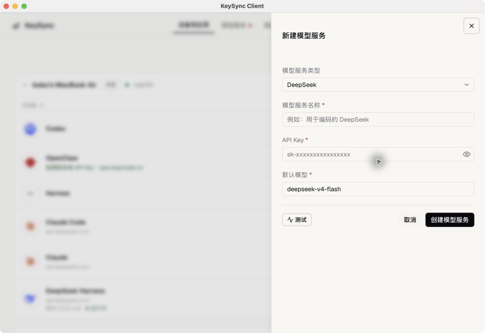
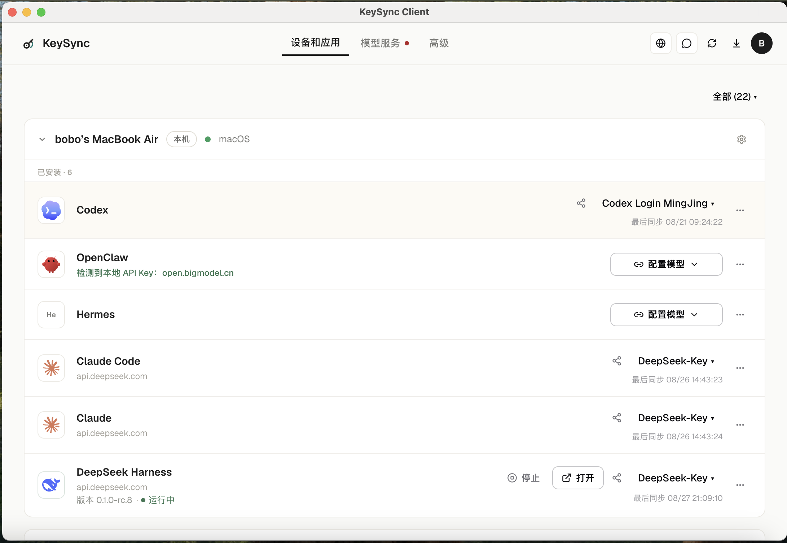
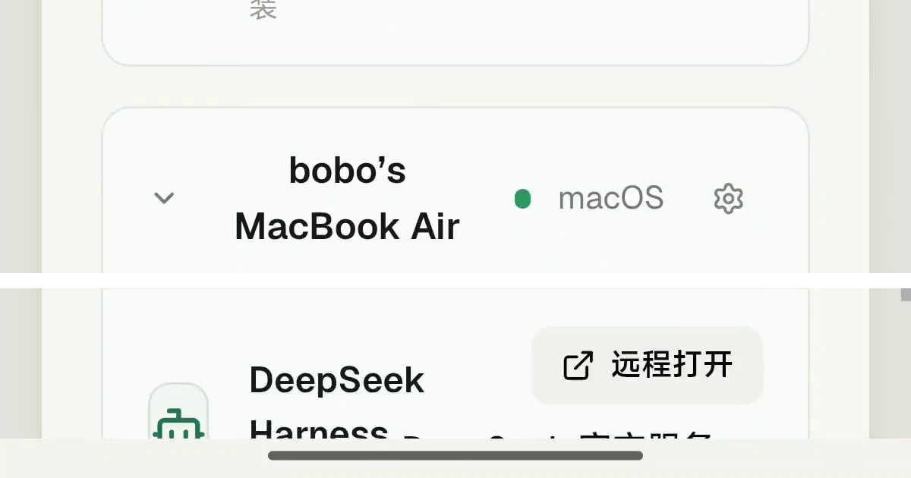
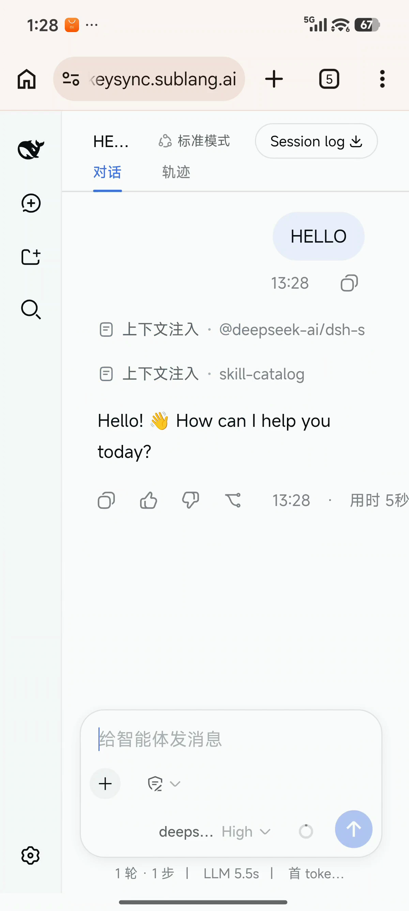

# 不用敲命令：小白 3 步用上 DeepSeek Harness，手机接着用

很多人想试 DeepSeek Harness，最后却卡在第一步：要不要装环境？要不要打开终端？是不是还得输入一长串命令？

如果你只想先把它用起来，可以走一条更简单的路：在电脑上安装 KeySync，让它帮你完成 DSH 安装；再添加自己的 DeepSeek 服务，最后用手机远程打开电脑上的同一个页面。

全程分三步。**不用另外安装 Node，也不用敲命令。**

> DeepSeek Harness 下面简称 DSH。你可以把它理解成一个在浏览器里和 AI 对话、继续处理任务的工作页面。

## 开始前，只准备这三样

1. 一台可以正常上网的电脑。
2. 一个 KeySync 账号，安装后可以直接注册。
3. 一个可用的 DeepSeek API Key。

API Key 可以理解成连接 DeepSeek 服务的一把“钥匙”。如果还没有，可以到 [DeepSeek 开放平台](https://platform.deepseek.com/) 创建。它只需要粘贴一次，不要发给别人，也不要放进截图里。

> KeySync 是帮助普通用户安装、打开和远程访问这些工具的第三方软件，不是 DSH 官方客户端，也不是开源项目。它支持 macOS、Windows、Linux；客户端和远程访问目前完全免费，没有隐藏收费。

## 第 1 步：安装 KeySync

打开 [KeySync 下载页](https://sublang.ai/keysync/download/)，选择自己的电脑系统。

- Mac：选择 **macOS (Apple Silicon)**。
- Windows：普通用户选择 **安装包 (x64)**。
- Linux：选择与电脑对应的 **AppImage**。

下载后，像安装普通软件一样完成安装，再打开 KeySync，注册或登录账号。

到这里就可以了。你不需要先装 Node，也不需要打开终端。

## 第 2 步：安装、配置并打开 DSH

这一步都在电脑上的 KeySync Client 里完成。

### 1. 一键安装 DeepSeek Harness

打开 **设备和应用**，找到 **DeepSeek Harness**，点击右侧的 **一键安装**。

第一次安装需要下载文件，等一会儿即可。页面出现 **已安装**，说明安装已经完成。

这里的“一键安装”只指 KeySync 帮你安装 DSH。接下来仍需要添加自己的 DeepSeek 服务。

### 2. 配置 DeepSeek 模型

在 DeepSeek Harness 这一行点击 **配置模型**，再选择：

**我已经有 → 手动创建**

按页面填写：

- 模型服务类型：选择 **DeepSeek**。
- 模型服务名称：自己起一个容易认的名字，例如“我的 DeepSeek”。
- API Key：粘贴刚才准备好的 DeepSeek API Key。
- 默认模型：保留页面自动填写的内容。

先点击 **测试**。测试成功后，再点击 **创建模型服务**。

如果测试失败，先检查 API Key 是否复制完整，再确认 DeepSeek 账号可以正常使用。

### 3. 打开 DeepSeek Harness

回到 **设备和应用** 页面。

如果先看到 **启动**，就点击它。等 DeepSeek Harness 这一行出现 **停止** 按钮，再点击旁边的 **打开**。

这里最容易判断：**能看到“停止”按钮，就说明 DSH 已经打开。**

浏览器出现 DeepSeek Harness 的对话页面后，电脑端就准备好了。你可以先新建一个对话，发送一句简单的话，确认能够正常收到回答。

## 第 3 步：用手机打开电脑上的同一个 DSH

出门前，先在电脑上确认三件事：

1. 电脑没有关机，并且可以上网。
2. KeySync 正在运行。
3. DeepSeek Harness 旁边可以看到 **停止** 按钮。

然后在手机浏览器打开 [KeySync 网页版](https://keysync.sublang.ai/)，登录与电脑端相同的 KeySync 账号。

手机和电脑**不需要连接同一个 Wi-Fi**。只要两边都能联网即可。

在网页中找到自己的电脑，再找到 **DeepSeek Harness**，点击 **远程打开**。

页面打开后，看到的就是电脑上已经打开的 DSH。原来的对话和任务仍然保留，可以接着使用。

需要注意：**任务仍在电脑上处理，手机只是远程打开它。**

所以电脑一旦关机、断网，或者 KeySync 被退出，手机就无法继续打开。关掉手机页面不会把电脑上的任务搬到手机里，也不会自动新建一段对话。

## 没成功，先检查这三处

### 手机显示电脑离线

检查电脑是否开机、联网，KeySync 是否仍在运行。

### 看不到“远程打开”

回到电脑，确认 DeepSeek Harness 已经打开。判断标准是它旁边出现 **停止** 按钮。

### 模型测试失败

重新复制 DeepSeek API Key，确认没有多空格、没有漏字符，并检查 DeepSeek 账号是否可以正常使用。

## 做到这三点，就算完成

1. 电脑端的 DeepSeek Harness 旁边能看到 **停止**。
2. 手机端能找到同一台电脑，并看到 **远程打开**。
3. 手机打开 DSH 后，电脑里原来的对话仍然在。

三项都满足，就说明安装、配置和手机远程访问已经打通。

## 最后把边界说清楚

这条路线适合不想处理安装环境和命令、还希望用手机接着操作的人。KeySync 做的事情很具体：把 DSH 的安装、打开和远程访问整理成普通用户更容易操作的页面。

如果你本来就会用命令安装 DSH，也不需要手机远程打开，那么直接使用 [DeepSeek Harness 官方项目](https://github.com/deepseek-ai/deepseek-harness) 就可以。

如果你最担心的是安装环境和终端命令，可以先把这篇收藏起来：在电脑走完前两步，再拿手机完成一次 **远程打开** 测试。

相关链接：

- [下载 KeySync](https://sublang.ai/keysync/download/)
- [打开 KeySync 网页版](https://keysync.sublang.ai/)
- [DeepSeek 开放平台](https://platform.deepseek.com/)
- [DeepSeek Harness 官方项目](https://github.com/deepseek-ai/deepseek-harness)
