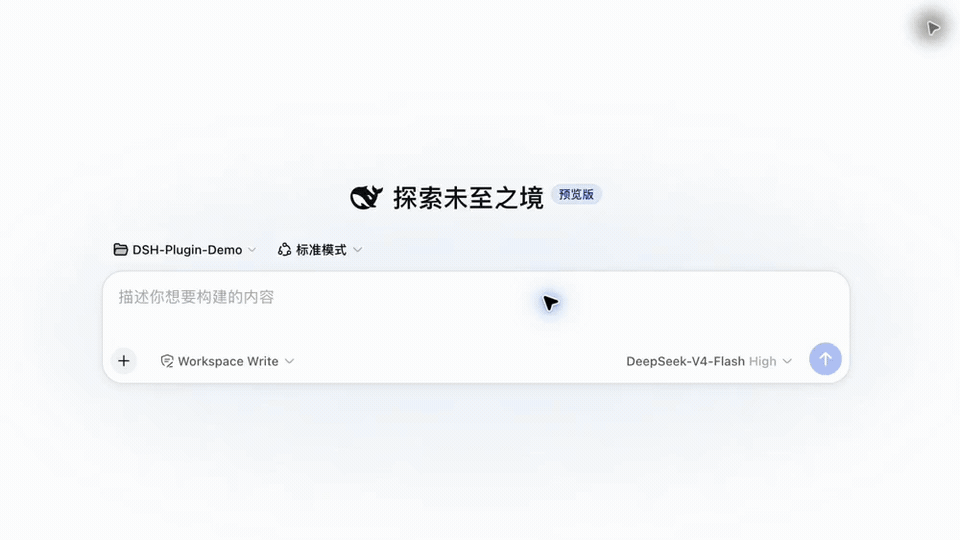
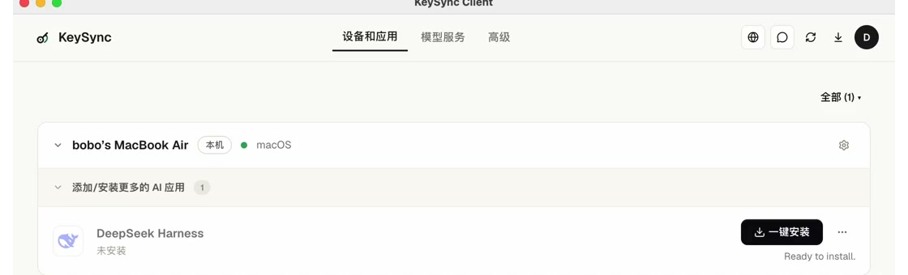
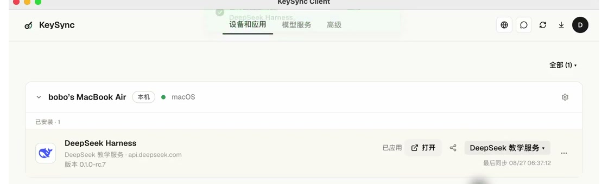
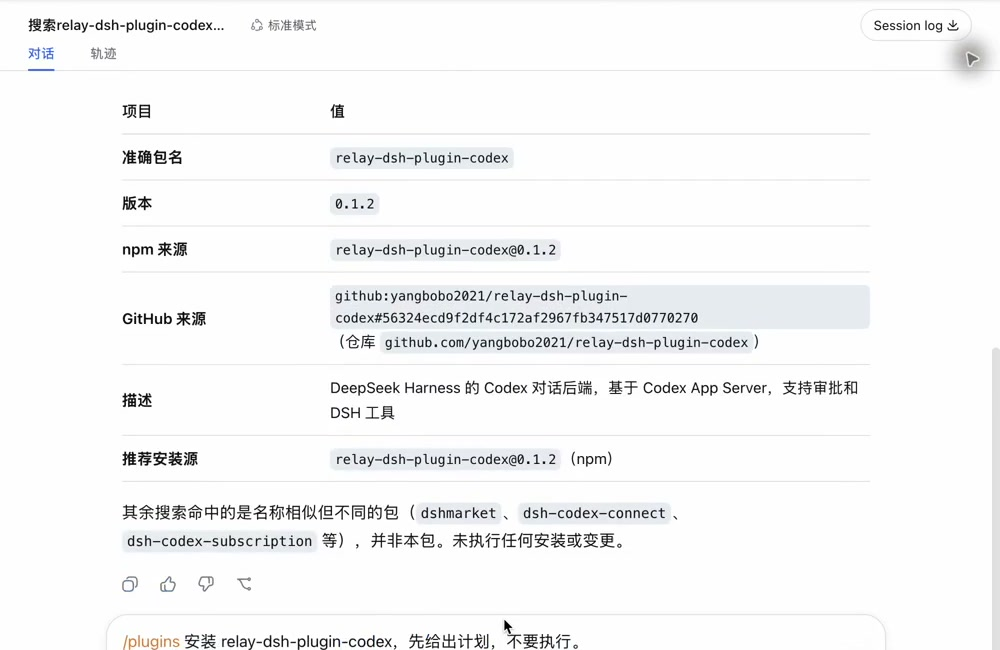
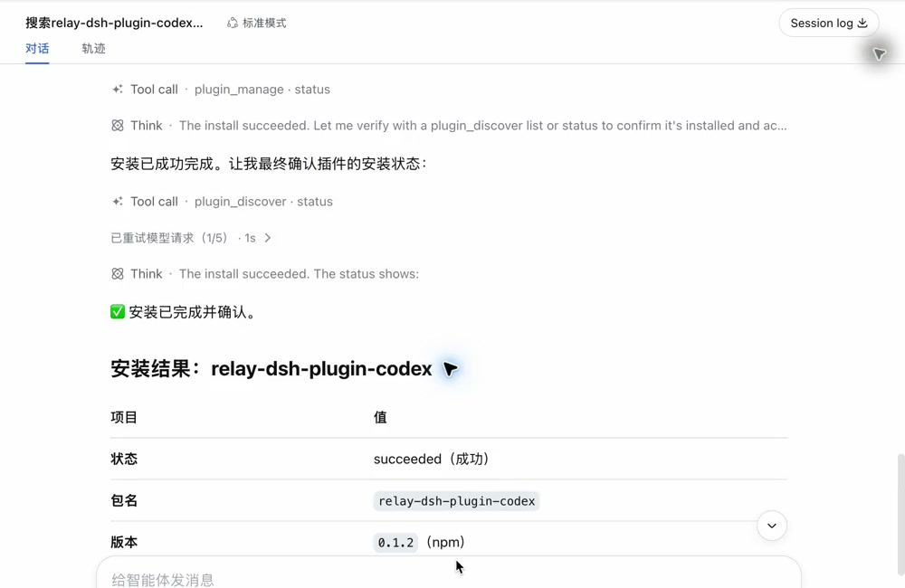

# 不用敲命令：小白 3 分钟学会 DSH 插件搜索与安装

安装插件听起来很麻烦：先找名字，再判断是不是找对了，最后还要输入一长串命令。

但如果你的 DSH 是通过 KeySync 安装的，这些步骤可以直接在对话框里完成。你只需要说三句话：**先找、先看、再确认。**



> 本文说的“3 分钟”，指 KeySync 已经安装、DSH 已经可以正常对话。第一次下载 DSH 可能需要多等一会儿。

## 先认清三个名字

- **KeySync**：帮助你安装、打开和管理 AI 工具的桌面软件。
- **DSH**：DeepSeek Harness 的简称，是一个可以和 AI 对话、处理工作的页面。
- **插件**：给 DSH 增加新功能的小工具。

这篇文章用“在 DSH 里加入 Codex”作为例子。以后想找别的功能，也可以照着同样的方法操作。

## 开始前：从 KeySync 打开 DSH

本文假设你已经安装 KeySync。

如果电脑里还没有，请先打开官方页面下载安装：

[KeySync 官方下载页](https://sublang.ai/keysync/download/)

打开 KeySync，在“设备和应用”里找到 **DeepSeek Harness**。

如果显示“未安装”，点击 **一键安装**，等待进度完成。KeySync 会把 DSH 和需要的插件助手一起准备好。



安装完成后，给 DSH 选择一个可以使用的 AI 服务，然后点击 **打开**。



能看到 DSH 的对话页面，就可以开始找插件了。

## 第 1 句：先帮我找，不要安装

在 DSH 新建一段对话，把下面这句话发出去：

```text
/plugins 帮我找一个能在 DSH 里使用 Codex 的插件。先只搜索，告诉我准确名字和来源，不要安装。
```

`/plugins` 可以理解成“打开插件助手”。后面的中文直接说明你想要什么。

DSH 会列出找到的插件、准确名字和来源。示例中找到的是：

```text
relay-dsh-plugin-codex
```

名字虽然有点长，但不需要背下来，后面直接复制即可。



> 搜索和查看不会安装任何东西。看到多个相似名字时，先核对准确名字和来源，不要急着确认。

## 第 2 句：先告诉我准备做什么

确认搜索结果后，再发送：

```text
/plugins 安装 relay-dsh-plugin-codex。先告诉我准备做什么，不要执行。
```

这时 DSH 只会给出安装计划，不会马上动手。

你只需要看三件事：插件名字是否正确、来源是否明确、安装后是否需要重新打开 DSH。

这样即使第一次操作，也有机会在安装前发现问题。

## 第 3 句：确认安装

计划没有问题，就发送：

```text
确认安装。
```

等待页面出现“安装成功”。如果提示需要重启，就回到 KeySync，关闭并重新打开 DSH。



整个过程最重要的不是记住插件名字，而是记住这个顺序：

> **先搜索，不安装；先看计划，不执行；最后再确认。**

## 换一个插件，也照这三句话说

以后不知道插件名字，可以直接描述自己想要的功能：

```text
/plugins 帮我找一个能【写下你想增加的功能】的插件，先只搜索，不要安装。
```

找到合适的结果后，再让它展示计划，最后单独确认。

这个方法比看到一个名字就立刻安装更稳妥，也更适合第一次使用插件的人。

## 没成功，先检查这三处

### 看不到 `/plugins`

回到 KeySync，确认 DeepSeek Harness 已经完成一键安装。然后关闭并重新打开 DSH。

### 消息发不出去

回到 KeySync，确认 DSH 旁边已经选择了一个可以使用的 AI 服务，再重新打开。

### 显示安装成功，但功能没出现

大多数情况只需要重启 DSH。插件通常会在下一次打开时生效。

## 最后记住一句话

插件不是越多越好。先想清楚自己缺什么功能，再搜索、看计划、确认安装。

第一次可以直接照着本文安装 Codex 插件。走完一次，以后安装其他 DSH 插件也会很顺手。
