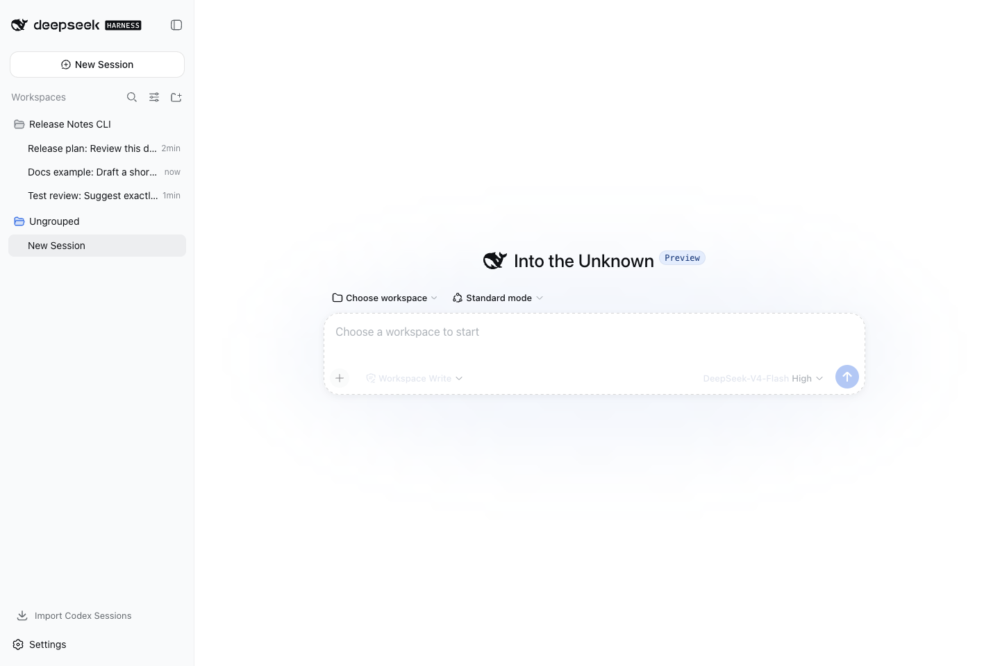

# 我不再按 AI 工具找聊天记录，而是按项目管理三个 Agent

我同时使用 DeepSeek Harness、Codex 和 Claude Code 后，最先遇到的问题不是模型怎么选，而是聊天记录越来越难找。

几天后回到一个项目，我经常要依次打开三个应用、搜索几个关键词，才能确认需求讨论、代码修改和独立审查分别进行到了哪里。真正浪费时间的，不是继续写代码，而是先找回项目现场。

后来我把工作单位从“应用”改成了“项目”：项目留在同一个 Workspace，工具按任务选择，每个 Agent 保留自己的原生会话。

这不是自动多 Agent 编排，但已经减少了很多无意义的切换。

## 统一的是项目入口，不是三个 Agent 的脑子

我用官方 DeepSeek Harness（DSH）管理 Workspace 和 Session，再通过独立插件加入 Codex 和 Claude Code 两种会话后端。

新建会话时，可以选择 DSH 原生模式、Codex 或 Claude Code。

这些会话可以放在同一个项目下面，但不会共享一段看不见的“万能记忆”：

- DSH 原生会话仍由 DSH 负责；
- Codex 会话绑定一个真实 Codex App Server Thread，也就是继续 Codex 里的原生对话；
- Claude Code 会话延续自己的 Claude Session，也就是继续 Claude Code 自己的对话。

这个边界很重要。统一的是项目入口、会话列表和工作目录，不是把三个 Agent 的上下文混在一起。出了问题，我仍然能判断是哪个执行后端做了什么。

## 已经做过的 Codex 工作不用从头讲

接入这套工作流时，我已经在 Codex 里积累了不少 Thread。

如果为了换一个管理界面，就要重新描述需求、测试和实现思路，这个工作流没有意义。

Codex 插件可以按当前 Workspace 扫描已有 Thread，把它们导入为普通 DSH Session。标题和最近活动顺序会保留，重复导入不会再创建一份。打开导入后的 Session，DSH 会显示已有对话，后续消息仍然继续原来的 Codex Thread。

这里并没有把 Codex 的模型上下文复制成另一套数据库。

Codex App Server 仍然拥有 Thread、工具状态和上下文压缩；DSH 保存用于界面展示的历史和一对一绑定。这样既能统一入口，也不会破坏 Codex 自己的运行机制。

## 我现在怎样分配任务

我的分法不是固定规则，大致是：

- 需求还不清楚，只是在讨论方案时，先用 DSH 原生会话；
- 需要连续读代码、改文件、运行命令和修测试时，新建或继续 Codex 会话；
- 实现完成后，需要另一种视角检查边界和遗漏时，单独开 Claude Code 会话。

例如开发一个插件功能，我会先把功能边界和验收场景写进仓库 SPEC，再让 Codex 实现。

实现完成后，不直接以“测试通过”作为结束。我会在全新目录安装正式包，用官方 DSH 走一次真实用户路径。Claude Code 可以用于独立检查代码和测试是否真的覆盖了 SPEC。

这套分工同时兼顾了质量、使用成本和任务特点。不是每个问题都需要最重的编码 Agent，也不是每个实现都应该只由同一个 Agent 自己审查。

## 先别把它想成自动协作

当前还不是自动多 Agent 编排。

DSH 不会自动把前一段需求讨论总结给 Codex，也不会在 Codex 完成后自动通知 Claude Code 审查。交接仍然由我决定，重要要求仍然要写进项目文件，而不是只依赖聊天历史。

这看起来没有那么“智能”，但边界更清楚：

- 哪个 Agent 拥有哪段上下文，是明确的；
- 哪一步由谁执行，是明确的；
- 交付要求写在仓库里，不会随着聊天窗口消失。

自动协调是下一阶段的问题。先把会话、项目和执行后端的边界做稳，反而更容易继续往前走。

## 对话旁边保留最小的项目现场

我还安装了可选的 Workbench、Files 和 Terminal 插件。

Codex 提到一个文件时，可以在右侧直接查看；需要核对命令时，可以打开底部真实终端。

Files 目前主要用于目录浏览和文本预览，不是完整代码编辑器。Terminal 使用后端真实 Shell，也不是在浏览器里模拟几行输出。

它们不能替代 IDE，但足够减少一种很具体的切换：Agent 说改了某个文件，我不用先去另一个窗口找到项目，再确认它说的是哪一份内容。

## 这套工作流真正解决了什么

它没有让 Codex 本身变得更聪明，也没有自动完成多 Agent 协作。

它解决的是三个更朴素的问题：

1. 同一个项目的对话不再按应用散落；
2. 已有 Codex Thread 可以继续，不必从头交代；
3. 普通讨论、代码实现和独立审查可以按任务选择工具。

如果你只使用一个 Agent，而且聊天记录从来没有散落，就没有必要为了统一而增加系统复杂度。

如果你已经同时使用 DSH、Codex 或 Claude Code，可以先做一个最小试行：

1. 选一个正在进行的真实项目；
2. 先接入你最常用的一个会话后端，不用一次装齐所有插件；
3. 连续使用一周，看看“寻找聊天记录”和“重新交代背景”的次数有没有减少。

如果没有减少，就没有必要为了统一继续增加复杂度。Codex 和 Claude Code 插件都可以单独安装，也不要求维护修改过的 DSH Fork。

Codex 插件：
https://github.com/yangbobo2021/relay-dsh-plugin-codex

Claude Code 插件：
https://github.com/yangbobo2021/relay-dsh-plugin-claude

完整插件组合和后续协作研究：
https://github.com/yangbobo2021/Relay
