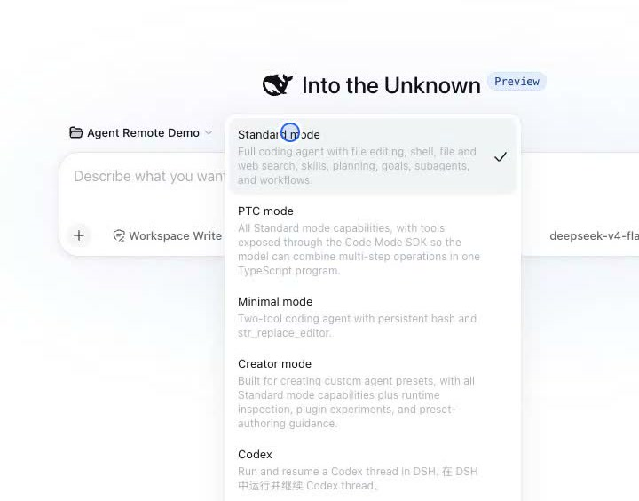
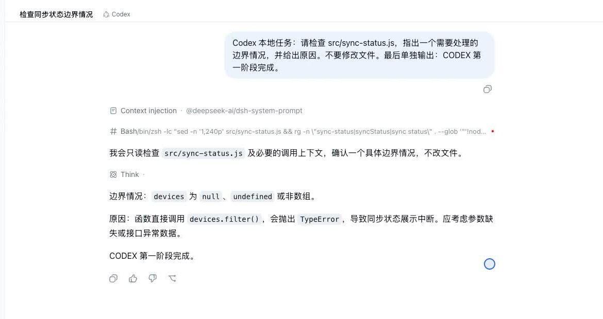

# 3 步在 DeepSeek Harness 里用上 Codex 对话

如果你已经打开过 DeepSeek Harness，又想让 Codex 帮你看代码，不需要在两个工具之间来回切换。

安装一个插件后，新建对话时直接选择 Codex，就可以在 DeepSeek Harness 的页面里提问、查看回答，并让 Codex 读取当前项目。

这篇文章只做一件事：带你完成第一次 Codex 对话。不会讲复杂原理，也不要求你先看懂技术架构。

## 先用大白话认识三个名字

**DeepSeek Harness 是什么？**

DeepSeek Harness 是 DeepSeek 开源的一套 AI 工作界面。你可以把电脑上的项目文件夹加进去，再为不同任务建立对话。它常被简称为 DSH，下面提到的 DSH 都是它。

**Codex 是什么？**

Codex 是 OpenAI 提供的 AI 编程助手。它不只回答问题，还能在你允许的项目里读取文件、修改代码和运行命令。

**插件是什么？**

插件就像给软件增加功能的小组件。本文使用的 Codex 插件，会在 DSH 的新建对话菜单里增加一个 Codex 选项。

## 开始前准备三样东西

开始前，请确认：

1. 电脑已经安装 Node.js 22.13 或更高版本；
2. 在终端里输入 `pnpm --version` 能看到版本号；
3. 你已经登录 Codex，并且平时能够正常使用它。

“终端”就是输入电脑命令的窗口。macOS 可以打开“终端”，Windows 可以打开 PowerShell。

如果 DSH 正在运行，先在终端里按 `Ctrl + C` 停止它。

## 第一步：安装 Codex 插件

把下面整条命令复制到终端，然后按回车：

```bash
npx @deepseek-ai/dsh@0.1.1-rc.2 plugin --profile web add relay-dsh-plugin-codex@latest
```

这条命令的作用很简单：为 DSH 的网页界面安装 Codex 插件。第一次运行时需要下载文件，稍等一会儿即可。

当终端没有显示红色错误，并重新出现可以输入命令的位置时，安装通常已经完成。

## 第二步：重新启动 DSH

继续在终端输入：

```bash
npx @deepseek-ai/dsh@0.1.1-rc.2 web
```

终端会显示一个网页地址，通常是 `http://127.0.0.1:3080`。在浏览器里打开它。

第一次使用时，先点击左侧的 **Add workspace**，选择一个准备让 Codex 查看或修改的项目文件夹。这里的 Workspace 就是“项目文件夹”。

建议先选一个测试项目，不要一开始就对重要文件动手。

## 第三步：新建一段 Codex 对话

点击左侧的 **New Session**。Session 就是一段新的对话。

找到输入框上方的 **Standard mode**，点开后选择 **Codex**。



看到 Codex 选项，说明插件已经被 DSH 识别。

第一次可以发送这句话：

> 先不要修改文件。请告诉我这个项目是做什么的，并列出三个主要文件。

这句话有两个好处：任务很简单，而且明确要求只读、不改文件，适合第一次验证。

发送后，页面顶部会显示当前使用的是 Codex。它能够读到项目内容并给出回答，就说明接入成功。



以后需要修改代码时，再把具体目标告诉它。例如：“请先说明准备改哪些文件，等我确认后再修改。”

## 遇到问题先看这三项

**菜单里没有 Codex**

先彻底停止并重新启动 DSH。插件是在启动时加载的，安装后不重启，菜单不会变化。

**输入框不能发送消息**

通常是还没有选择项目文件夹。点击 **Add workspace**，选择一个文件夹后再新建对话。

**第一条消息提示登录失败**

先在同一个电脑账户中完成 Codex 登录，再重启 DSH。插件负责把 Codex 接到 DSH 里，但不会替你登录账号。

## 你可能根本不需要这个插件

如果你只使用 Codex，而且不打算在 DSH 中管理项目和对话，直接使用 Codex 会更简单。

这个插件适合已经在使用 DSH，又希望在同一个页面里完成 Codex 编程任务的人。它不会让 Codex突然变得更聪明，也不会自动安排多个 AI 互相协作。

先用一个测试项目完成上面的只读提问。能够看到 Codex 回答，就已经完成了第一次接入。

DeepSeek Harness：
https://github.com/deepseek-ai/deepseek-harness

Codex 插件：
https://github.com/yangbobo2021/relay-dsh-plugin-codex
